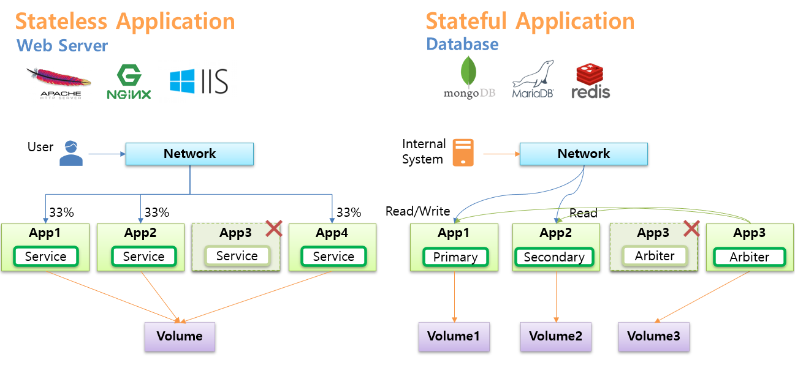
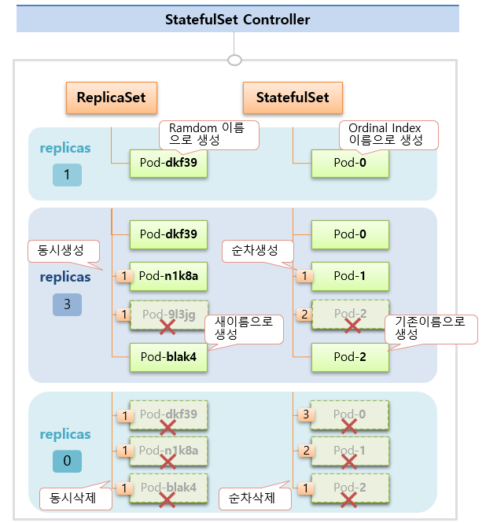
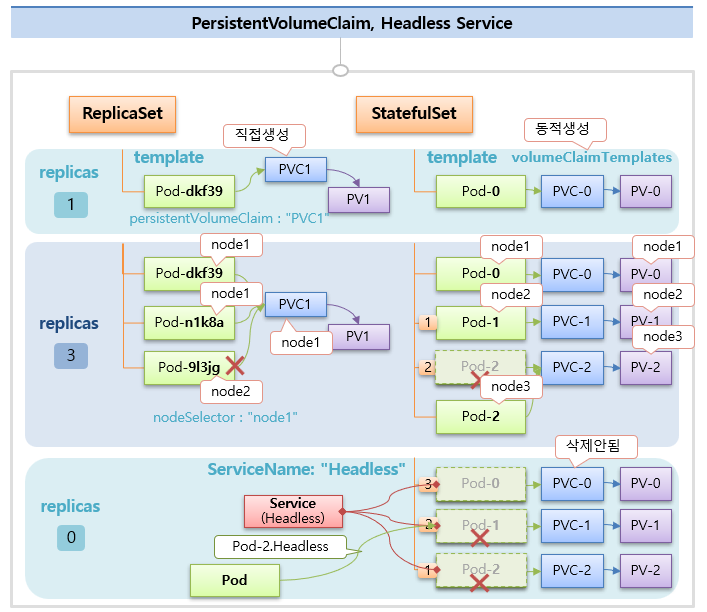

# StatefulSet

 

## Stateless App vs Stateful App
* 아래 그림 참고
  * Primary/Secondary/Arbiter 의 내용은 MongoDB에 해당
  * 
* Stateless App에 대한 Pod는 ReplicaSet Controller으로,
* Stateful App에 대한 Pod는 StatefulSet Controller으로 생성 및 관리가 가능하다.
* 여러 파드에 트래픽을 분산가능한 Stateless App과는 다르게, StatefulSet으로 생성된 Pod에는 각 역할에 해당하는 Pod에 직접적인 연결이 필요하므로 Headless Service를 사용
  * 

  

## StatefulSet Controller 동작 (ReplicaSet과 비교)
* replicas로 Pod 생성시
  * ReplicaSet: Random 이름으로 Pod가 생성됨
  * StatefulSet: **Ordinal Index** 이름으로 Pod가 순차적으로 생성됨
* replicas 늘려서 Pod 생성시
  * ReplicaSet: replicas 개수만큼 Pod 동시 생성
  * StatefulSet: Index가 **낮은 순서**대로 순차적으로 Pod 생성 (Running상태가 되면 다음 Pod 생성)
* Pod 재생성시 - Pod에 문제가 생기거나 관리자가 임의로 삭제한 경우
  * ReplicaSet: 새 이름으로 Pod 생성
  * StatefulSet: **기존 이름**으로 Pod 다시 생성
* replicas 줄여서 Pod 삭제시
  * ReplicaSet: 줄인 개수만큼 동시에 삭제
  * StatefulSet: Index가 **높은 순서**대로 Pod 삭제
* 

  

## StatefulSet에 PVC(PersistentVolumeClaim)와 Headless Service 연결하기
* 
* StatefulSet으로 생성되는 Pod에 PV를 연결하려면 PVC가 생성되어 있어야 함
* `Todo`