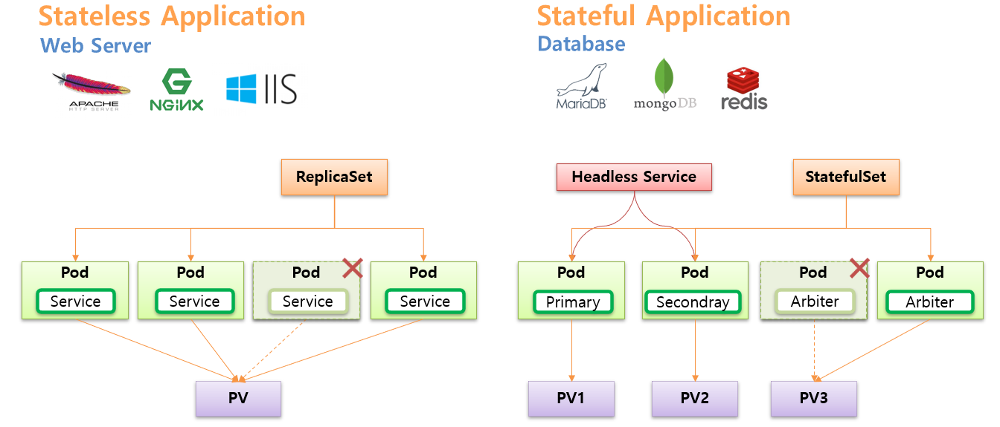

# StatefulSet

## Stateless App vs Stateful App
* 아래 그림 참고
  * Primary/Secondary/Arbiter 의 내용은 MongoDB에 해당
  * 
* Stateless App에 대한 Pod는 ReplicaSet Controller으로,
* Stateful App에 대한 Pod는 StatefulSet Controller으로 생성 및 관리가 가능하다.
* 여러 파드에 트래픽을 분산가능한 Stateless App과는 다르게, StatefulSet으로 생성된 Pod에는 각 역할에 해당하는 Pod에 직접적인 연결이 필요하므로 Headless Service를 사용
  * 
