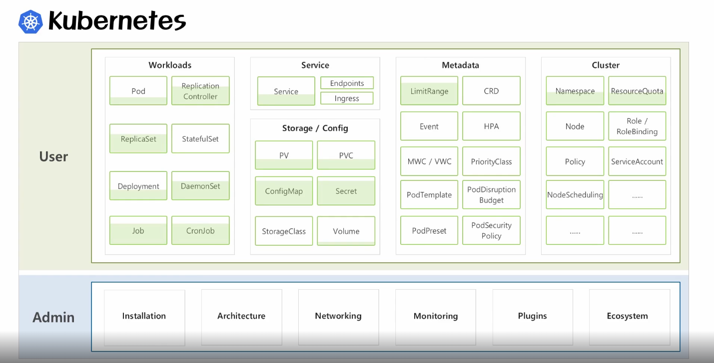

# Section 1

## 컨테이너
* 컨테이너 가상화 기술은 서비스간에 자원격리를 하는데 OS를 별도로 안띄워도 됨
* OS 기동시간이 없기 때문에, 자동화시에 엄청 빠르고 자원 효율도 매우 높음

## 오케스트레이터 Orchestrator
* 도커는 하나의 서비스를 컨테이너로 가상화 시켜서 배포를 하는것이지, 
  많은 서비스들을 운영할때 일일이 배포하고 운영하는 역할을 해주진 않음
* 여러 컨테이너들을 관리해주는 솔루션을 `오케스트레이터` 라고 함
* kubernetes는 서비스 배포 운영에 필요한 표준(가장 많이 사용) 오케스트레이터임
* kubernetes는 크게 운영자와 사용자로 나뉨
  * kubernetes cluster를 운영하는 운영자
  * kubernetes 기능들을 활용해서 서비스를 배포하는 사용자
* 초급 ~ 중급 강의에서는 사용자의 기능 일부를 다룸 (아래 그림에서 초록색으로 칠해진 만큼...)
  * 

## 도커와 컨테이너 생태계의 변화과정
* https://blog.siner.io/2021/10/23/container-ecosystem/