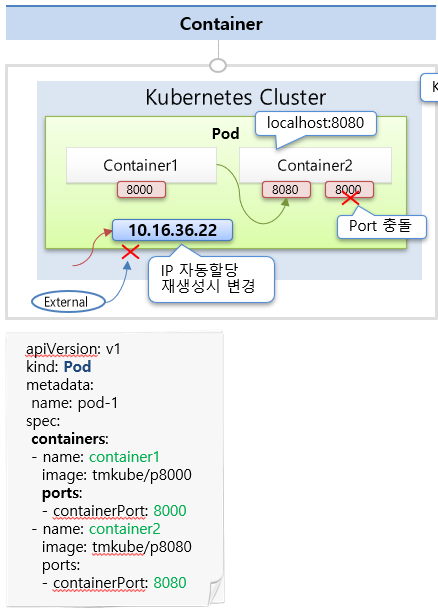
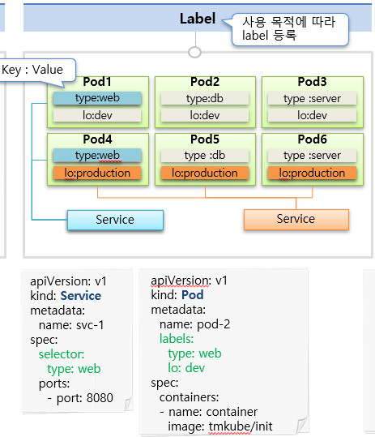
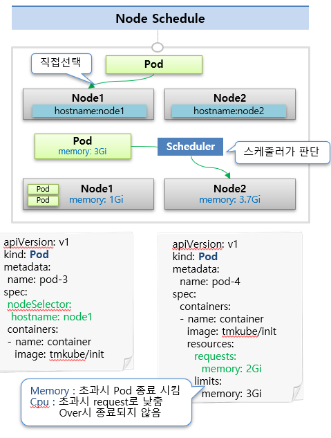

# Pod
* Pod란 **클러스터에서 실행 중인 컨테이너 집합**이다.
* Pod는 생성시 고유한 IP주소가 할당됨
* k8s 클러스터내에서만 Pod의 IP를 통해 해당 Pod에 접근 가능 (외부에서 접근 불가)
  * Pod에 문제가 생기면 삭제되고 다시 생성되는데 IP도 새로 할당됨

## Container
* Pod안에 하나의 독립적인 서비스를 구동할 수 있는 Container들이 있음
* Container는 각각 여러개의 포트를 가질 수 있지만 중복은 안됨
* Container들은 하나의 호스트내에 묶여 있기 때문에 `localhost:{port}` 주소로 접근 가능함
* 

## Label
* Label은 Pod뿐만 아니라 모든 오브젝트에 할당 가능함, **Pod에서 가장 많이 사용됨**
* Label은 `Key:value`를 한 쌍으로 구성
* Pod를 만들때 `labels`항목에 `key:value`를 넣을 수 있음 (아래 이미지 참고)
* Service를 만들때 `selector`항목에 Label을 적어주면 Label에 해당하는 Pod와 연결됨 (아래 이미지 참고)
* 

## Node Schedule
* Pod는 실행중인 여러 노드중 하나의 노드에 올라가야 하는데, 직접 선택하는 방법과 스케줄러 판단하에 자동으로 올리는 방법이 있음
* 직접 선택
  * Node에 Label을 달고 Pod를 만들때 Node를 지정할 수 있음
  * Pod를 만들때 `nodeSelector`항목에 Node의 label과 매칭되는 key:value를 넣으면 됨 (아래 이미지 참고)
* 스케줄러가 판단(자동)
  * Node에는 사용가능한 리소스의 양이 정해져 있음 (ex. 메모리, CPU)
  * Pod의 자원 사용량과 Node의 남은 자원량을 스케줄러가 판단해서 Pod를 배치함
  * ex. 어떤 Pod가 사용하는 메모리가 2G이고 Node1이 사용가능한 메모리가 1G, Node2가 사용가능한 메모리가 3.7G라고 한다면
    * Pod가 Node1로 들어갈 경우, 부하가 큰 상황에서 해당 Pod가 메모리 자원을 무한정 사용하려고 할것임
    * 이러한 경우 메모리 사용량이 초과되어 Node1내의 다른 Pod가 메모리 자원을 활용할 수 없기 때문에 장애가 발생할 것임
* 