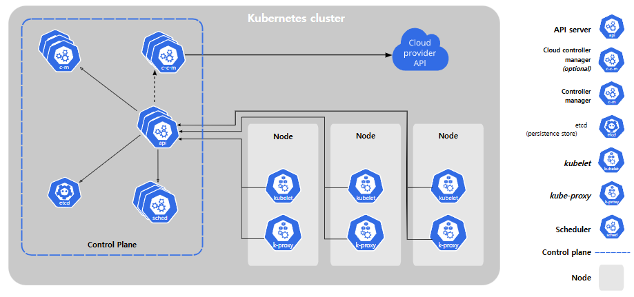
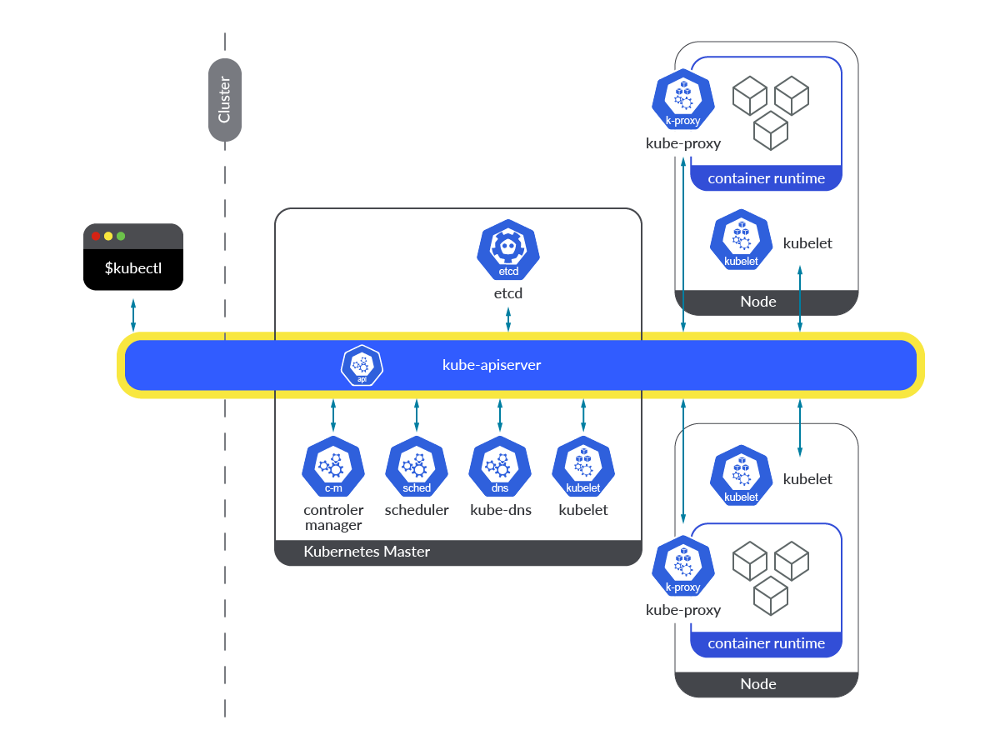
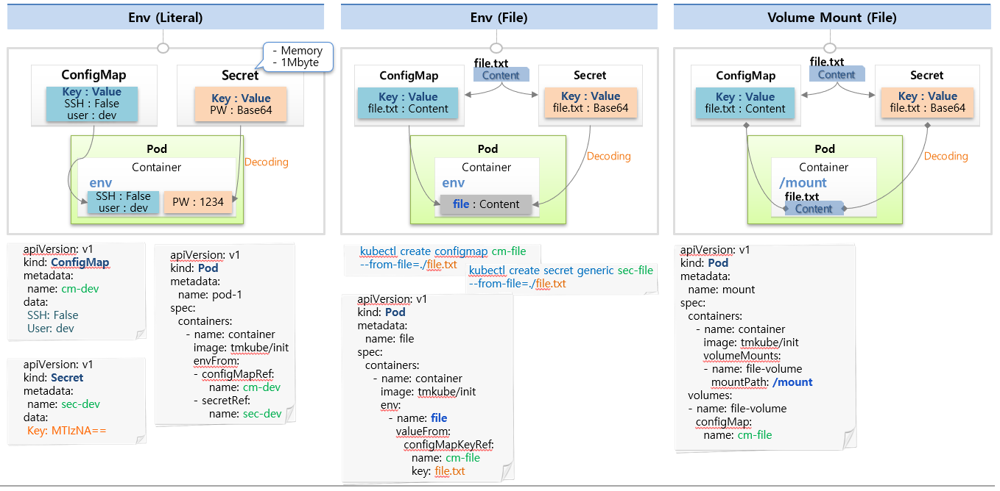

## ConfigMap과 Secret 공부하기전 사전 지식
### Kubernetes Cluster의 아키텍처
* [공식 문서](https://kubernetes.io/ko/docs/concepts/overview/components/)
* Control Plane 노드(=Master Node): 클러스터의 머리 역할
* Worker 노드: 사용자가 배포한 컨테이너가 실행되는 곳
* Kubelet
  * 쿠버네티스 노드에서 실행되는 노드 에이전트로 Pod의 생성, 실행 및 모니터링에 핵심적인 역할을 수행
  * 노드 상태 및 리소스를 관리하고 ControlPlane과의 통신을 위한 징검다리 역할
* k8s Cluster 구성도
* Cluster 구성도 ex1.
  * 
* Cluster 구성도 ex2.
  * 

### etcd란 ?
* API 서버의 기본 데이터 저장소임 (위 그림 참고)
* 쿠버네티스 클러스터의 데이터베이스 라고 보면 됨
* key:value 형태의 데이터를 저장하는 스토리지
* 클러스터에 어떤 노드가 몇 개나 있고 어떤 파드가 어떤 노드에서 동작하고 있는지 등이 etcd에 기록됨
  * 쿠버네티스에서 일어나는 모든 이벤트를 저장하고 있는 저장소임
* 자세한 내용은 [etcd 기본 동작 원리의 이해](https://tech.kakao.com/posts/484) 참고

### tmpfs란 ? (linux)
* 리눅스에서 사용하는 메모리에 기반한 파일 시스템으로, 메모리를 파일처럼 사용할 수 있게 하는 파일 시스템이라고 보면 됨
* 메모리에서 데이터를 읽고 쓰기 때문에 디스크 기반 파일 시스템보다 빠름
* 즉, tmpfs안의 파일을 읽고 쓰는 속도가 일반 파일 시스템의 파일 읽고 쓰는 속도보다 월등히 빠름
* 휘발성 파일 시스템으로 일시적인 데이터를 저장하는 데 사용 (특정 디렉토리에 **마운트된 파일 시스템이 아님**)
  * **서버 재부팅 하면 tmpfs안의 모든 파일은 지워짐**
* 할당된 용량 이상이 사용되면 오류가 발생하므로 tmpfs 용량 늘려주어야 함

<br>

## ConfigMap과 Secret

### ConfigMap
* ConfigMap은 key:value 쌍으로 **기밀이 아닌** 데이터를 저장하는 데 사용하는 API 오브젝트
* 아래 내용은 ConfigMap과 Secret 모두에 해당하는 내용
* 환경(Dev, Prod...)에 따라 변하는 값들을 외부에서 결정하도록 도와주는 역할을 함
* Pod 생성시에 ConfigMap과 Secret을 연결할 수 있음 (아래의 그림의 yaml파일 참고)
* ConfigMap과 Secret은 많은 양의 데이터를 보유하도록 설계되지 않음
  * ConfigMap과 Secret은 하나의 데이터당 최대 1M까지 저장이 가능하다.
  * API 서버(control plane component) 및 kubelet 메모리를 고갈시킬 수 있는 매우 큰 시크릿의 생성을 방지하기 위함
  * 이 제한보다 큰 설정을 저장해야 하는 경우, 볼륨을 마운트하는 것을 고려하거나 별도의 데이터베이스를 사용하는 것이 좋음

### Secret
* Secret에는 Config와는 다르게 암호, 토큰 또는 키와 같은 **기밀 데이터**를 포함하는 오브젝트
* Secret을 사용한다는 것은 사용자의 기밀 데이터를 애플리케이션 코드에 넣을 필요가 없음을 뜻하며, ConfigMap보다 노출 위험이 적다.
* Secret은 기본적으로 쿠버네티스 클러스터의 DB(etcd)에 평문(암호화x)으로 저장됨
  * value의 데이터는 Base64로 인코딩한 값이 들어가야 하는데 이는 난독화이지 암호화가 아님
  * 또한 base64 인코딩 수행을 원하지 않는다면, 그 대신 stringData 필드를 사용할 수 있음
    ~~~yaml
    apiVersion: v1
    kind: Secret
    metadata:
        name: bootstrap-token-5emitj
        namespace: kube-system
    type: bootstrap.kubernetes.io/token
    data: # value를 Base64인코딩할 경우
        auth-extra-groups: c3lzdGVtOmJvb3RzdHJhcHBlcnM6a3ViZWFkbTpkZWZhdWx0LW5vZGUtdG9rZW4=
        expiration: MjAyMC0wOS0xM1QwNDozOToxMFo=
        token-id: NWVtaXRq
        token-secret: a3E0Z2lodnN6emduMXAwcg==
        usage-bootstrap-authentication: dHJ1ZQ==
        usage-bootstrap-signing: dHJ1ZQ==
    ~~~
    ~~~yaml
    apiVersion: v1
    kind: Secret
    metadata:
        name: bootstrap-token-5emitj
        namespace: kube-system
    type: bootstrap.kubernetes.io/token
    stringData: # value로 stringData 사용시
        auth-extra-groups: "system:bootstrappers:kubeadm:default-node-token"
        expiration: "2020-09-13T04:39:10Z"
        token-id: "5emitj"
        token-secret: "kq4gihvszzgn1p0r"
        usage-bootstrap-authentication: "true"
        usage-bootstrap-signing: "true"
    ~~~
* Secret이 ConfigMap보다 보안성이 좋다? Secret과 ConfigMap 차이 ?
  * 해당 노드의 파드가 필요로 하는 경우에만 Secret이 노드로 전송된다.
    * Pod 설정에 `privileged: true` 옵션 넣으면 Secret의 모든 데이터에 접근할 수도 있다고 함
  * Secret을 파드 내부로 마운트할 때, 기밀 데이터가 보존적인(durable) 저장소에 기록되지 않도록 하기 위해 kubelet이 데이터 복제본을 tmpfs(휘발성)에 저장
    * tmpfs: 위의 `tmpfs란?` 항목 참고
  * Secret을 사용하는 파드가 삭제되면, kubelet은 Secret에 있던 기밀 데이터의 로컬 복사본을 삭제함
* todo1: ConfigMap을 사용하는 파드 삭제시 ConfigMap삭제되는지 확인하기
* todo2: 파드에서 ConfigMapRef로 정의되지 않은 ConfigMap 데이터에 접근 가능한지 확인하기

## ConfigMap & Secret 생성 방법
* ConfigMap과 Secert은 데이터로 상수, 환경변수 파일, Volume Mount 파일로 생성이 가능하다.

### 1. Env (Literal)
* 가장 기본 형태인, key:value에 상수를 넣는 방식
* ConfigMap에 필요한 상수를 정의하면 파드를 생성할 때 ConfigMap을 가져와서 환경변수(env)에 설정함
* Secret이 파드로 주입될 땐 base64 디코딩되어 저장됨

### 2. Env (File)
* 파일을 통째로 ConfigMap에 담을 수 있음
  * file이름이 key가 되고 파일의 내용은 value로 저장하여 ConfigMap을 만듦
* 파일을 ConfigMap으로 만드는 것은 대시보드에서 지원해주지 않아 Node에서 명령어로 직접 생성
  * 명령어로 Secret을 생성시 value는 자동으로 Base64로 인코딩되어 저장됨
  ```bash
  # ConfigMap
  # file-c.txt 라는 파일로 cm-file라는 이름의 ConfigMap 생성
  kubectl create configmap cm-file --from-file=./file-c.txt
  # key1:value1 라는 상수로 cm-file라는 이름의 ConfigMap 생성
  kubectl create configmap cm-file --from-literal=key1=value1
  # 여러 key:value로 cm-file라는 이름의 ConfigMap 생성 
  kubectl create configmap cm-file --from-literal=key1=value1 --from-literal=key2=value2

  # Secret
  # file-s.txt 라는 파일로 sec-file라는 이름의 Secret 생성
  kubectl create secret generic sec-file --from-file=./file-s.txt
  # key1:value1 라는 상수로 sec-file라는 이름의 Secret 생성
  kubectl create secret generic sec-file --from-literal=key1=value1
  ```
* 파일 이름이 key, 내용이 value 된다.
* Pod 생성 방법은 아래 그림 참고

### 3. Volume Mount (File)
* ConfigMap이나 Secret의 File을 마운팅 하여 사용
* File을 ConfigMap이나 Secret으로 생성하는 방법까지는 2번의 내용과 같음
* Pod 생성시 volume mount path를 정의하고 volume내의 ConfigMap이나 Secret을 받아올 수 있음
* Volume Mount 방식과 2.환경변수(Env)를 이용하는 방식과 차이점?
  * 환경변수 사용시
    * ConfigMap의 내용이 변경되어도 ConfigMap에서 받아온 Pod의 환경변수 값들은 변경되지 않음
    * Pod가 재생성되어야만 변경된 값을 받아올 수 있음
  * File을 Mount하여 받아올 경우
    * ConfigMap의 내용 변경시 Pod에서 해당하는 내용들도 변경됨

### ConfigMap & Secret 그림 설명
