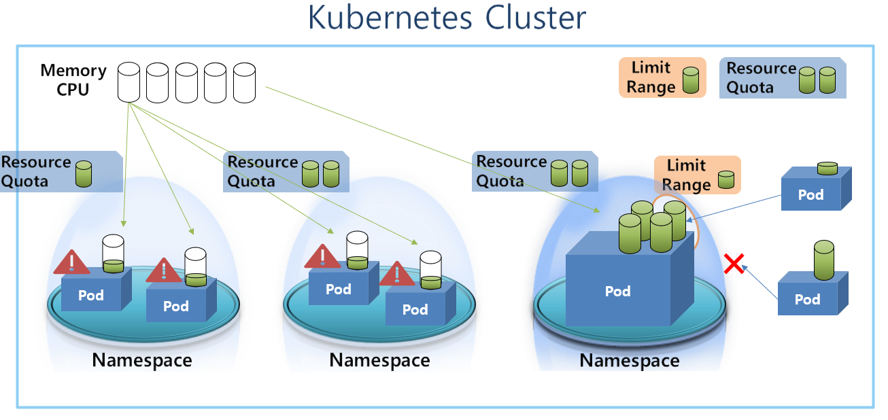
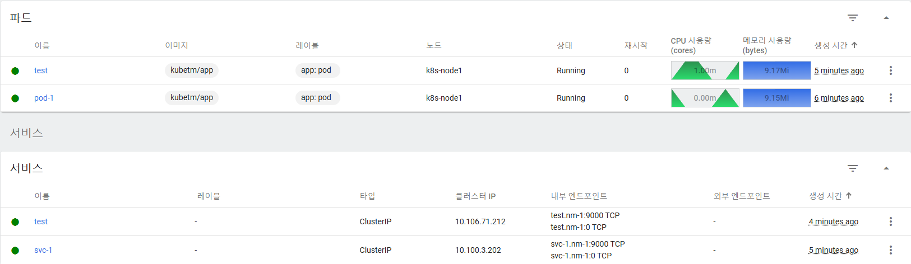
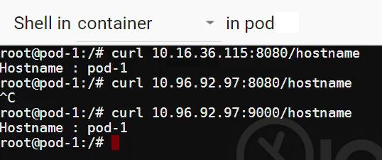
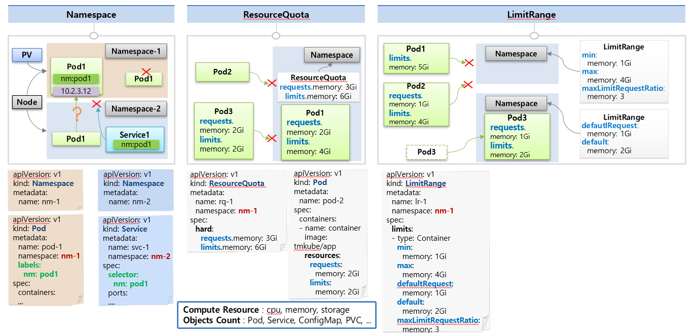

# Namespace, ResourceQuota, LimitRange
* Namespace는 쿠버네티스 클러스터 내의 논리적인 분리 단위 ex. dev-namespace, prod-namespace
* 논리적으로 분리할 수 있는 다른 방법도 있는데 왜 Namespace가 필요할까 ?
  * Cluster resource를 관리할 수 있기 때문
    * Pod는 Cluster자원으로부터 필요한 자원을 얻음
    * 특정 Pod가 자원을 독점하면 Cluster내의 다른 Pod에서 자원 부족으로 문제가 발생하기 때문에
    * 제한된 리소스를 사용하는 Namespace라는 그룹에 Pod를 생성하는 것임
    * Namespace마다 ResourceQuota를 설정하여 memory, cpu와 같은 자원을 제한할 수 있음
    * Namespace에 LimitRange를 설정하여 해당 Namespace에 들어올 Pod 크기를 제한할 수 있음
  * Namespace로 구분하면 특정 Pod 문제가 다른 Namespace의 Pod들에게 전파되지 않는다는 장점도 있음
* ResourceQuota와 LimitRange
  * ResourceQuota는 Namespace의 자원 크기를 제한한다면, LimitRange는 Namespace에 들어올 Pod의 자원 크기를 제한한다.
* 그림 참고
  

<br>

## Namespace
* 클러스터 내에서 리소스를 그룹화하는 방법
* 하나의 Namespace내에서 같은 오브젝트들끼리 이름을 중복하여 생성할 수 없음
  * 다른 오브젝트들끼리는 상관없음 (test Pod, test Service 확인)
  
* Namespace들은 자원이 분리되어 있음
  * ex. 어떤 Namespace의 Service가 타 Namespace에 있는 Label을 selector에 사용해도 타 Namespace의 Pod와 연결되지 않음
  * 하지만 Namespace가 Ip트래픽은 막아주지 않음
    * `Network policy` 오브젝트를 거쳐서 연결이 가능하도록 설계되어 있음
    * 아래는 한 Pod에서 다른 Namespace에 생성된 Pod(`10.16.36.115:8080`)와 Service(`10.96.92.97:9000`)에 접근하는 모습임
    * 
  * Node나 PV의 자원은 제외
    * Namespace로 분리되는 자원이 아니기 때문
  * Namespace내에 NodePort 타입 Service를 생성할 수는 있지만 다른 Namespace에 같은 포트로 NodePort Service생성 불가
    * Namespace는 클러스터 내의 논리적인 분리 단위이고,
    * 클러스터 내의 각각의 node들은 Namespace에 포함되어 있지 않기 때문에
    * Namespace를 구분한다고 해도, 모든 노드의 port가 하나의 Service에 바인딩되는 NodePort Service는
    * 같은 port로 생성할 수 없는 것임
    * 즉, Namespace와는 별개로 같은 port를 사용하는 NodePort Service는 생성할 수 없음
* Namespace 삭제시 Namespace내의 모든 오브젝트 또한 같이 제거됨
  

## ResourceQuota
* Namespace별 총 리소스 사용을 제한하는 역할을 함
* ResourceQuota의 request와 limits 옵션 차이
  * 요청(request)은 컨테이너에 대해 보장된 CPU 또는 메모리 리소스를 정의
  * 제한(limit)은 다른 컨테이너의 사용량에 따라 컨테이너가 사용할 수 있는 메모리 또는 CPU 임계값을 의미
* Pod생성시 Namespace의 ResourceQuota에 설정된 자원에 대해 정의해 주지 않으면 해당 Namespace에 Pod생성 불가함 (cf. 그림의 Pod2 참고)
  * ResourceQuota에 설정된 자원에 대해 정의했다고 하더라도 해당 Pod 생성시 제한을 초과하게 된다면 Pod생성 불가 (cf. 그림의 Pod3 참고)
* ResourceQuota에서 제한할 수 있는 옵션들
  * Compute Resource
    * cpu, memory, storage
  * Object Count
    * Pod, Service, ConfigMap, PVC, 등등 k8s 버전에 따라 다름
* ResourceQuota 생성후 잘 만들어 졌는지 확인은 DashBoard에서는 못함. Console로 확인
  ```yaml
  # 대시보드에서 생성
  apiVersion: v1
  kind: ResourceQuota
  metadata:
    name: rq-1
    namespace: nm-3
  spec:
    hard:
      requests.memory: 1Gi
      limits.memory: 1Gi
  ```
  ```bash
  # Console에서 확인
  master> kubectl describe resourcequotas --namespace=nm-3
  ```
* 주의할 점!
  * ResourceQuota 생성하기 전에 생성된 Pod가 있다면 ResourceQuota 제한에 포함되지 않기 때문에
  * Namespace ResourceQuota 생성전에 생성된 오브젝트가 있다면, 삭제를 먼저 하고 ResourceQuota를 생성해 주어야 함

<br>

## LimitRange
* Namespace에 들어오는 Pod의 자원 크기를 제한하는 역할을 함 (Pod 자원 크기 안맞으면 Namespace에 못들어옴)
* LimitRange 옵션
  * min - 해당하는 자원의 최소 크기 제한
    * ex. min:memory: 1Gi
  * max - 해당하는 자원의 최대 크기 제한
    * ex. max:memory: 4Gi
  * maxLimitRequestRatio - requet값과 limit값의 비율 제한
    * ex. maxLimitRequestRatio:memory: 3
    * cf. 아래의 그림에서 Pod2의 경우 requet와 limit이 4배차이가 나기 떄문에 해당 Namespace에 들어올 수 없음
  * defaultRequest & default
    * Pod 생성시 requet와 limits에 대한 정의를 하지 않아도 자동 할당해 줌
    * defaultRequest의 값이 request, default값이 limits에 할당됨
    * cf. 아래 그림의 Pod3 참고
* LimitRange의 type마다 지원되는 옵션이 다르기 때문에 문서 참고해야 할듯
  * cf. 아래의 그림은 Container 타입으로 Container마다 제한을 거는 옵션들임
* LimitRange 역시 생성 확인은 DashBoard에서는 못함. Console로 확인
  ```bash
  master> kubectl describe limitranges --namespace=nm-5
  ```
* 주의할 점!
  * 하나의 Namespace에는 여러개의 LimitRange를 설정할 수 있음
  * 여러개의 LimitRange를 사용할 경우, 예상치 못한 동작으로 Pod가 생성이 안될 수도 있기 때문에 주의 해야 함

<br>

## Namespace, ResourceQuota, LimitRange 그림 설명
