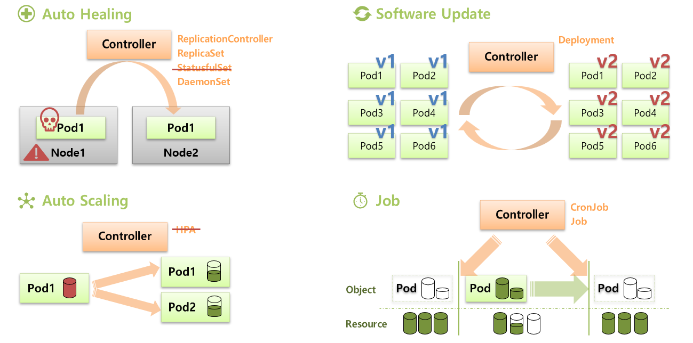

# Section 5
* [Controller 공식문서](https://kubernetes.io/ko/docs/concepts/architecture/controller/)

## Controller란
* 공식 문서 출처 - k8s의 Controller란 클러스터의 상태를 관찰 한 다음, 필요한 경우에 생성 또는 변경을 요청하는 **컨트롤 루프**이다.
  * 컨트롤 루프: 시스템 상태를 조절하는 종료되지 않는 루프 (ex. 실내 온도 조절기)
  * 각 컨트롤러는 현재 클러스터 상태를 모니터링하며 의도한 상태와 차이가 생겼을 경우,
  * 생성 또는 변경을 요청을 하여 현재 상태를 의도한 상태에 가깝게 이동시킨다.
* 서비스를 관리하고 운영하는데 도움을 준다.
  * Auto Healing
    * Controller가 장애가 생긴 Pod를 감지하고 재생성
    * ex. Pod가 down되거나 Node가 down될 경우 다른 노드에 Pod를 새로 할당
  * Auto Scaling
    * Pod의 자원이 limit 상태에 도달한 경우 Controller가 이를 감지하고 Replicas를 증가시켜 Pod의 수를 늘림
  * Software Update
    * deployment 워크로드 - ReCreate, RollingUpdate, Rollback
  * Job
    * 일시적인 작업 필요한 경우, Controller가 Pod를 생성하여 해당 작업을 수행하고 Pod삭제
    * 일시적으로 자원을 사용하고 반환하기 때문에 효율적임

## Controller 역할 그림 설명
* 

