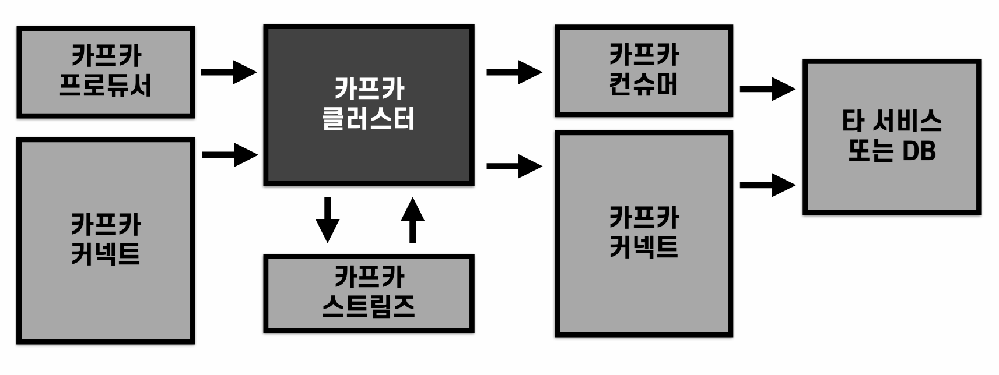

## Kafka local 환경(window)에서 실행하기
* [참고링크](https://soonmin.tistory.com/22)
* 실행 스크립트 참고
  ```sh
  cd C:\kafka_2.13-3.8.1
  .\bin\windows\zookeeper-server-start.bat config\zookeeper.properties
  .\bin\windows\kafka-server-start.bat config\server.properties

  # c.f. port
  netstat -ano | find "LISTEN"
  netstat -ano | find "2181" # zookeeper 포트
  netstat -ano | find "9092" # 브로커 포트
  ```

<br><br>

## 1. 카프카 구조
* 프로듀서
  * 프로듀서는 메시지를 생성하여 메시지 큐에 전달하는 역할
  * 프로듀서는 동기식 또는 비동기식으로 메시지를 전송할 수 있음
* 컨슈머
  * 컨슈머는 메시지 큐에서 메시지를 가져와 처리하는 역할
  * 메시지 큐에서 메시지를 순차적으로 가져와 처리
    * 파티션에서 커밋된(컨슈머로 처리된) 메시지 이후의 메시지부터 처리
  * 컨슈머 그룹?
    * 컨슈머 그룹은 동일한 그룹 ID를 가진 하나 이상의 Kafka 컨슈머 인스턴스 집합
    * 이 그룹은 하나의 토픽을 여러 컨슈머가 나눠서 병렬로 메시지를 처리할 수 있게 해줌
    * 즉, 컨슈머 그룹 내의 각 컨슈머는 토픽의 파티션을 분배받아 독립적으로 메시지를 읽고 처리
    * 부하 분산, 고가용성을 위함
    * 일반적으로 MSA 환경에서는 컨슈머 그룹을 마이크로서비스 단위로 설정
* 토픽
  * 토픽은 메시지를 특정 주제나 테마에 따라 분류하는 메커니즘
  * 프로듀서가 메시지를 특정 주제로 발행하고, 컨슈머가 해당 주제에 관심이 있는 메시지만 수신할 수 있도록 함
  * 즉, 프로듀서는 메시지를 특정 토픽에 발행하고, 컨슈머는 해당 토픽을 구독하여 메시지를 받음 (pub-sub 패턴)
  * cf. Lag 이란?
    * lag = (토픽의 최신 오프셋) - (컨슈머 그룹이 읽은 오프셋)
    * lag가 크면 컨슈머가 메시지를 제때 처리하지 못하고 있다는 뜻
    * 시스템 병목, 장애, 컨슈머 다운, 처리 성능 저하, 파티션 불균형 등의 문제가 원인임
* 파티션
  * 파티션은 큐로 이루어져 있어 메시지의 순서를 유지
  * Kafka의 파티션은 데이터를 분산 저장하는 단위 (데이터의 복제가 아님)
  * 메시지는 특정 키에 따라 파티션으로 분배되며, 각 파티션의 메시지는 독립적으로 처리됨
  * 파티션은 메시지를 여러 개의 하위 그룹으로 나누어 저장하고 처리하는 방식
  * 예를들어, 토픽의 파티션 설정 개수가 10개라고 가정할때,
    * 주문 이벤트를 저장하는 "orders"라는 토픽이 있다고 가정하면, 이 토픽에 대한 10개의 파티션이 생성됨
    * 주문 ID같은 특정 키를 파티션 키로 사용할 수 있고, 같은 주문에 대한 이벤트(생성, 결제, 배송 등)는 항상 같은 파티션에 저장되어 순서가 보장됨
    * 주문 이벤트가 발생할때 Kafka 프로듀서는 주문 ID를 키로, 해시를 계산하거나 라운드로빈 방식 등으로 파티션을 선택함
    * 즉, 주문 A는 파티션 1, 주문 B는 파티션 2, 주문 C는 파티션 3에 저장될 수 있어 같은 키를 가진 메시지는 항상 같은 파티션에 저장되어 순서가 보장됨
    * 동시에 여러 Consumer가 각 파티션을 병렬로 읽어 주문 처리 속도가 크게 향상됨
  * 동일한 파티션의 복제본은 여러 브로커에 분산하여 저장됨 - 고가용성
    * 각 파티션은 하나의 리더(leader)와 여러 팔로워(follower) 복제본을 가짐 (복제 수는 브로커의 수를 초과할 수 없음)
    * 리더 파티션은 한 브로커에 있고, 팔로워 파티션들은 다른 브로커에 위치
    * 프로듀서와 컨슈머는 항상 리더 파티션을 통해 데이터를 주고받으며, 팔로워 파티션들은 리더의 데이터를 실시간으로 복제하는 방식
* 브로커
  * kafka 클러스터내에 존재하는 작업 단위
  * 메시지 데이터는 모든 브로커에 복제되어 offset이 저장된 세그먼트 파일 시스템 형태로 저장된다.
  * 브로커의 그룹 코디네이터 역할
    * 토픽내의 파티션 하나에 컨슈머 하나가 1:1로 대응되지만, 특정 컨슈머에 문제가 생길 경우 해당하는 파티션을 다른 컨슈머에 재할당(리밸런스) 시켜줌
    * 컨슈머 그룹의 상태를 체크하고 토픽의 파티션을 컨슈머와 매칭되도록 분배하는 역할을 함
  * 컨슈머 오프셋 저장
    * 컨슈머 그룹이 파티션의 어느 레코드까지 가져갔는지 확인하기 위해 오프셋을 커밋함
  * 데이터를 삭제 할 수 있음. (컨슈머나 프로듀서를 통해서 데이터 삭제는 불가능)
  * 다수의 브로커중 하나는 컨트롤러 역할을 함.
    * 컨트롤러는 다른 브로커들의 상태를 체크한다.
    * 어떤 브로커의 상태가 비정상이라면 클러스터에서 해당 브로커를 제외시키고 해당 브로커의 파티션을 재분배 하는 역할을 한다.
* 

<br><br>

## 2. Kafka 특징
* **높은 처리량**
  * 카프카는 프로듀서가 브로커로 데이터를 보낼 때와 컨슈머가 브로커로부터 데이터를 받을 때 모두 묶어서 전송
    * 네트워크 통신 횟수 줄어듦
  * 많은 양의 데이터를 묶음 단위로 처리하는 배치로 빠르게 처리할 수도 있음
  * 파티션 단위를 통해 동일 목적의 데이터를 여러 파티션에 분배하고 데이터를 병렬 처리할 수 있음
    * 파티션 개수만큼 컨슈머 개수를 늘려서 동일 시간당 데이터 처리량을 늘리는 것
* **확장성**
  * 메시지 양에 따라서 클러스터의 브로커 개수(파티션에 1:1대응)를 scale-out / scale-in 할 수 있음
    * scale-out: 브로커 늘림, in은 반대
  * 365일 24시간 데이터를 처리해야 하는 서비스에서 안정적으로 운영이 가능함
* **영속성**
  * 카프카에서 프로듀서로부터 전송받은 메시지 데이터들은 메모리에 저장하지 않고 파일 시스템에 저장됨
  * 따라서 브로커에 급작스럽게 장애가 발생하더라도, 브로커를 재시작하고 파일시스템에 저장된 데이터를 불러와 메시지를 다시 처리할 수 있음
* **고가용성**
  * 프로듀서로부터 전송받은 데이터의 복제를 통해 고가용성의 특징을 가짐
  * 즉, 프로듀서로부터 전송받은 데이터는 1대의 브로커에만 저장되는 것이 아니라 다른 브로커들 모두에도 저장되어 있으므로,
  * 저장된 데이터를 기준으로 지속적으로 데이터 처리가 가능한 것

<br><br>

## 3. Batch 데이터와 Stream 데이터 ?
* Batch 데이터
  * 한정된 데이터 세트를 일정 기간 동안 수집한 후, 이를 한꺼번에 처리
  * 대규모 데이터 처리에 적합
  * 예시
    * 급여 처리: 회사에서 직원의 근무 기록을 한 달 또는 2주 단위로 모아서 한 번에 급여를 계산하고 지급하는 작업
    * 카드 거래 정산: 하루 동안 발생한 신용카드 거래를 모아서 일정 시점에 한 번에 정산하는 작업
* Stream 데이터
  * 지속적으로 들어오는 데이터를 실시간으로 처리
  * 실시간 분석 및 빠른 응답이 필요할 때 적합
  * Batch 프로세싱과 비교하여 낮은 지연시간으로 생성되는 데이터
  * 예시
    * 실시간 위치 추적: 차량, 배달, 택시 서비스 등에서 GPS 센서가 지속적으로 위치 정보를 전송하여 실시간으로 위치를 추적하는 경우
    * 실시간 로그 분석: 서버나 애플리케이션에서 발생하는 로그 데이터를 실시간으로 수집하고 분석하여 장애를 즉시 탐지하는 경우

### 3.1. Kafka에서는 Batch데이터와 Stream데이터를 모두 처리할 수 있음
* 어떻게?
  * Kafka에서는 메시지 로그에 시간을 남기기 때문에, Stream으로 적재된 데이터를 Batch데이터로 처리할 수 있음
* 

<br><br>

## 4. Kafka Streams
* Kafka Streams는 kafka의 **topic의 데이터**를 읽고 **변환 처리**한 후 그 결과를 kafka의 **topic에 저장**하는 작업을 해줌
* 출처 - [confluent 공식 문서](https://docs.confluent.io/platform/current/streams/architecture.html)
* Kafka Streams API를 사용하는 애플리케이션의 구조
  * 

<br>

### 4.1. Kafka Streams란 ?
  * Apache Kafka 기반의 실시간 데이터 처리를 위한 자바 라이브러리
  * Kafka 토픽에서 데이터를 읽고(Source Processor), 변환 or 가공 처리한 후(Stream Processor), 다시 Kafka 토픽으로 결과를 저장(Sink Processor)하는 작업을 수행함
  * Kafka Streams는 별도의 클러스터를 필요로 하지 않고, 라이브러리 형태로 일반 Java 애플리케이션을 통해 구현 가능

<br>

### 4.2. Kafka Streams 구조 ?
* Kafka Streams 는 Tree형 Topology 구조를 가짐, DAG임
* 노드를 `Processor`, 간선을 `Stream` 이라고 부름
* 
* `Processor` ?
  * `소스 프로세서(Source Processor)`
    * 소스 프로세서는 Kafka 토픽에서 데이터를 읽어오는 시작점임
    * 하나 이상의 Kafka 토픽을 구독하고, 레코드를 스트림 처리 파이프라인으로 전달
  * `스트림 프로세서(Stream Processor)`
    * 스트림 프로세서는 데이터 변환, 필터링, 집계 등의 비즈니스 로직을 수행하는 핵심 컴포넌트
  * `싱크 프로세서(Sink Processor)`
    * 싱크 프로세서는 처리된 데이터를 Kafka 토픽 또는 외부 시스템에 쓰는 종착점
    * 다운스트림 프로세서가 없으며, 최종 결과를 출력함
    * 즉, 최종 처리된 데이터를 어떤 토픽에 저장하는 역할을 함

<br>

### 4.3. kafka Producer와 Consumer를 이용하면 되는 내용인데 Kafka Streams를 쓰는 이유?
* `실시간 데이터 처리` - Kafka 공식 Java 라이브러리로, 실시간 데이터 처리(필터, 변환, 집계, 조인 등)를 손쉽게 구현 가능
  * 여러 Producer/Consumer 조합으로 처리하던 복잡한 구조를 Kafka Streams를 이용하여 단순화
* `부하 분산` - 내부적으로 파티션 단위로 작업을 분산 처리하고, 여러 인스턴스를 실행하면 자동으로 파티션을 나눠 병렬로 처리
* `failover 및 확장성` - 장애 발생 시 상태 저장소를 기반으로 자동 복구 및 재처리가 가능, 인스턴스를 추가하면 자동으로 파티션이 재분배되어 수평 확장이 용이
* `시간 기반 윈도우 연산` - 이벤트 타임, 처리 타임 등 다양한 시간 기반 윈도우 연산(예: 5분 집계, 슬라이딩 윈도우 등)을 지원
  * 단순 Consumer로는 구현이 어려움
* `상태 저장` - 로컬 RocksDB 등으로 상태를 직접 저장하며, Kafka 내부 토픽을 통해 장애 복구 및 정확성을 보장
  * 별도의 cluster 필요 없이 애플리케이션 단위로 내장 실행
* `Exactly-once 처리 보장` - 메시지의 중복 처리나 누락 없이 정확히 한 번만 처리하는 것을 보장

<br>

### 4.4. Streams DSL(Domain Specific Language)
* [참고 링크](https://goslim56.tistory.com/29)
* 미리 제공되는 함수들을 이용하여 토폴로지를 정의하는 방식
* 이벤트 기반 데이터 처리에 필요한 기능들을 제공하기 때문에 스트림즈를 구현하기 편함
* 대부분의 변환 로직을 어렵지 않게 개발할 수 있도록 스트림 프로세싱에 쓰일만한 다양한 기능들을 자체 API로 제공
  * 이벤트 기반 데이터 처리를 할 때 필요한 다양한 기능들(map, join, window 등)을 대부분 제공
* stateful 프로세싱, stateless 프로세싱
* Stateful 데이터 처리에 강함. 아래는 stateful 프로세싱의 주요 연산 예시
  * count: 키별 레코드 수 집계 - `stream.groupByKey().count()`
  * reduce: 키별 값 누적 연산 - `stream.groupByKey().reduce((v1, v2) -> v1 + v2)`
  * aggregate: 사용자 정의 초기값 + **집계** - `stream.groupByKey().aggregate(() -> 0L, (k, v, agg) -> agg + v.length())`
  * windowed: 시간 기반 윈도우 집계 ex.5분 간격 매출 계산 - `stream.groupByKey().windowedBy(TimeWindows.of(Duration.ofMinutes(5))).count()`
  * join: 스트림/테이블 조인 - `stream.join(otherStream, (v1, v2) -> v1 + v2, JoinWindows.of(Duration.ofSeconds(10)))`
* stateless 데이터 처리도 가능
  * filter:	조건에 맞는 레코드만 필터링	- `stream.filter((k, v) -> v > 100)`
  * map: 레코드 변환 - `stream.mapValues(v -> v.toUpperCase())`
  * flatMap: 레코드를 여러 개로 분할 - `stream.flatMapValues(v -> Arrays.asList(v.split(" ")))`
  * branch: 조건별로 스트림 분기 - `KStream<String, String>[] branches = stream.branch(pred1, pred2)`
  * merge: 여러 스트림을 하나로 병합 - `stream1.merge(stream2)`
* KStream, KTable, GlobalKTable ?
  * `todo`
* `application.id`: consumer의 Group Id와 동일한 역할로 Streams App을 구분하기 위한 고유 Id에 해당

<br><br>

## 5. Kafka Connect
* Kafka Connect는 데이터 파이프라인 생성시 반복 작업을 줄이고 효율적인 전송을 하기 위한 애플리케이션임
  * DB나 FS와 연결하는데 사용함
    * ex. DB의 데이터를 Topic에 저장하고자 할때, DB에서 select하고 Topic에 Produce하는 과정을 Template으로 만들어 반복적으로 사용할 수 있음
  * 특정 작업 형태를 템플릿으로 만들어 놓은 Connector를 실행함으로써 반복 작업을 줄일 수 있다.
* Kafka Connect 작동 방식
  * 
  * Source Connector: Producer 역할
  * Sink Connector: Consumer 역할
  * Connector는 오픈 소스를 이용할수도 있고 직접 개발하여 사용할 수도 있음
    * 오픈 소스 커넥터 ex. HDFS 커넥터, AWS S3 커넥터, JDBC 커넥터, ElasticSearch 커넥터 등
* Kafka Connect 내부 구조
  * 
  * Kafka Connect 생성시 Connector와 Task를 생성해야 함
    * Connector에서는 주로 설정 값에 대한 Validation 로직들이 들어가고 모니터링에도 활용됨
    * Task는 Thread하나가 할당되며, 실질적인 데이터 처리 로직(DB와 연결, 리소스와 커넥트 등)이 들어감
### Kafka Connect를 실행하는 방법
* 단일 모드 커넥트 (Standalone Mode Kafka Connect)
  * 개발 환경 구성 용도
* 분산 모드 커넥트 (Distributed Mode Kafka Connect)
  * 고가용성 구성 용도, failover 가능
  * 분산모드에서는 데이터량이 많아져 Consumer Lag이 늘어나거나 지연이 발생하는 경우 커넥트를 scale-out할 수 있음, scale-in도 마찬가지.

<br><br>

## 6. Kafka Streams vs Kafka Connect - `todo`
* * stateful 프로세싱, stateless 프로세싱?

<br><br>

## 7. 카프카 기술별 아키텍처 총 정리
