## cf. Kafka local 환경(window)에서 실행하기
* [참고링크](https://soonmin.tistory.com/22)
* 실행 스크립트 참고
  ```sh
  cd C:\kafka_2.13-3.8.1
  .\bin\windows\zookeeper-server-start.bat config\zookeeper.properties
  .\bin\windows\kafka-server-start.bat config\server.properties

  # c.f. port
  netstat -ano | find "LISTEN"
  netstat -ano | find "2181" # zookeeper 포트
  netstat -ano | find "9092" # 브로커 포트
  ```

<br><br>

## 1. 카프카 구조
* 카프카란?
  * 실시간으로 스트리밍 데이터를 수집하고 처리하는 데 최적화된 분산 데이터 스토어
* 프로듀서
  * 프로듀서는 메시지를 생성하여 메시지 큐에 전달하는 역할
  * 프로듀서는 동기식 또는 비동기식으로 메시지를 전송할 수 있음
* 컨슈머
  * 컨슈머는 메시지 큐에서 메시지를 가져와 처리하는 역할
  * 메시지 큐에서 메시지를 순차적으로 가져와 처리
    * 파티션에서 커밋된(컨슈머로 처리된) 메시지 이후의 메시지부터 처리
  * 컨슈머 그룹?
    * 컨슈머 그룹은 동일한 그룹 ID를 가진 하나 이상의 Kafka 컨슈머 인스턴스 집합
    * 이 그룹은 하나의 토픽을 여러 컨슈머가 나눠서 병렬로 메시지를 처리할 수 있게 해줌
    * 즉, 컨슈머 그룹 내의 각 컨슈머는 토픽의 파티션을 분배받아 독립적으로 메시지를 읽고 처리
    * 부하 분산, 고가용성을 위함
    * 일반적으로 MSA 환경에서는 컨슈머 그룹을 마이크로서비스 단위로 설정
* 토픽
  * 토픽은 메시지를 특정 주제나 테마에 따라 분류하는 메커니즘
  * 프로듀서가 메시지를 특정 주제로 발행하고, 컨슈머가 해당 주제에 관심이 있는 메시지만 수신할 수 있도록 함
  * 즉, 프로듀서는 메시지를 특정 토픽에 발행하고, 컨슈머는 해당 토픽을 구독하여 메시지를 받음 (pub-sub 패턴)
  * cf. Lag 이란?
    * lag = (토픽의 최신 오프셋) - (컨슈머 그룹이 읽은 오프셋)
    * lag가 크면 컨슈머가 메시지를 제때 처리하지 못하고 있다는 뜻
    * 시스템 병목, 장애, 컨슈머 다운, 처리 성능 저하, 파티션 불균형 등의 문제가 원인임
* 파티션
  * 파티션은 큐로 이루어져 있어 메시지의 순서를 유지
  * Kafka의 파티션은 데이터를 분산 저장하는 단위 (데이터의 복제가 아님)
  * 메시지는 특정 키에 따라 파티션으로 분배되며, 각 파티션의 메시지는 독립적으로 처리됨
  * 파티션은 메시지를 여러 개의 하위 그룹으로 나누어 저장하고 처리하는 방식
  * 예를들어, 토픽의 파티션 설정 개수가 10개라고 가정할때,
    * 주문 이벤트를 저장하는 "orders"라는 토픽이 있다고 가정하면, 이 토픽에 대한 10개의 파티션이 생성됨
    * 주문 ID같은 특정 키를 파티션 키로 사용할 수 있고, 같은 주문에 대한 이벤트(생성, 결제, 배송 등)는 항상 같은 파티션에 저장되어 순서가 보장됨
    * 주문 이벤트가 발생할때 Kafka 프로듀서는 주문 ID를 키로, 해시를 계산하거나 라운드로빈 방식 등으로 파티션을 선택함
    * 즉, 주문 A는 파티션 1, 주문 B는 파티션 2, 주문 C는 파티션 3에 저장될 수 있어 같은 키를 가진 메시지는 항상 같은 파티션에 저장되어 순서가 보장됨
    * 동시에 여러 Consumer가 각 파티션을 병렬로 읽어 주문 처리 속도가 크게 향상됨
  * 동일한 파티션의 복제본은 여러 브로커에 분산하여 저장됨 - 고가용성
    * 각 파티션은 하나의 리더(leader)와 여러 팔로워(follower) 복제본을 가짐 (복제 수는 브로커의 수를 초과할 수 없음)
    * 리더 파티션은 한 브로커에 있고, 팔로워 파티션들은 다른 브로커에 위치
    * 프로듀서와 컨슈머는 항상 리더 파티션을 통해 데이터를 주고받으며, 팔로워 파티션들은 리더의 데이터를 실시간으로 복제하는 방식
* 브로커
  * kafka 클러스터내에 존재하는 작업 단위
  * 각 브로커는 하나 이상의 토픽 파티션을 관리하고, 데이터의 복제본을 유지
  * 데이터는 모든 브로커에 복제되어 offset이 저장된 세그먼트 파일 시스템 형태로 저장된다.
    * offset: 어디까지 데이터를 읽었는지에 대한 위치 정보
  * 브로커의 그룹 코디네이터 역할
    * 토픽내의 파티션 하나에 컨슈머 하나가 1:1로 대응되지만, 특정 컨슈머에 문제가 생길 경우 해당하는 파티션을 다른 컨슈머에 재할당(리밸런스) 시켜줌
    * 컨슈머 그룹의 상태를 체크하고 토픽의 파티션을 컨슈머와 매칭되도록 분배하는 역할을 함
  * 컨슈머 오프셋 저장
    * 컨슈머 그룹이 파티션의 어느 레코드까지 가져갔는지 확인하기 위해 오프셋을 커밋함
  * 데이터를 삭제 할 수 있음. (컨슈머나 프로듀서를 통해서 데이터 삭제는 불가능)
  * 다수의 브로커중 하나는 컨트롤러 역할을 함.
    * 컨트롤러는 다른 브로커들의 상태를 체크한다.
    * 어떤 브로커의 상태가 비정상이라면 클러스터에서 해당 브로커를 제외시키고 해당 브로커의 파티션을 재분배 하는 역할을 한다.
* 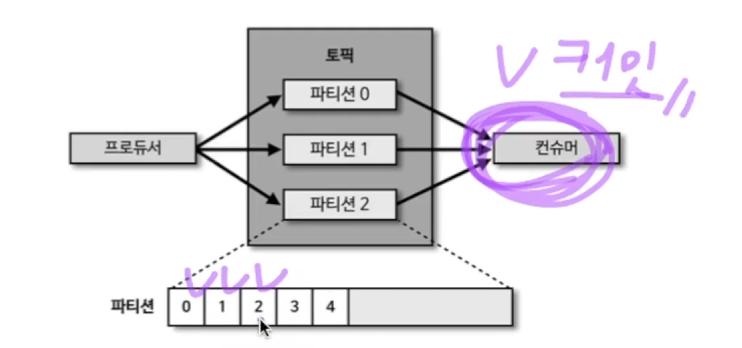

<br><br>

## 2. Kafka 특징
* **높은 처리량**
  * 카프카는 프로듀서가 브로커로 데이터를 보낼 때와 컨슈머가 브로커로부터 데이터를 받을 때 모두 묶어서 전송
    * 네트워크 통신 횟수 줄어듦
  * 많은 양의 데이터를 묶음 단위로 처리하는 배치로 빠르게 처리할 수도 있음
  * 파티션 단위를 통해 동일 목적의 데이터를 여러 파티션에 분배하고 데이터를 병렬 처리할 수 있음
    * 파티션 개수만큼 컨슈머 개수를 늘려서 동일 시간당 데이터 처리량을 늘리는 것
* **확장성**
  * 메시지 양에 따라서 클러스터의 브로커 개수(파티션에 1:1대응)를 scale-out / scale-in 할 수 있음
    * scale-out: 브로커 늘림, in은 반대
  * 365일 24시간 데이터를 처리해야 하는 서비스에서 안정적으로 운영이 가능함
* **영속성**
  * 카프카에서 프로듀서로부터 전송받은 메시지 데이터들은 메모리에 저장하지 않고 파일 시스템에 저장됨
  * 따라서 브로커에 급작스럽게 장애가 발생하더라도, 브로커를 재시작하고 파일시스템에 저장된 데이터를 불러와 메시지를 다시 처리할 수 있음
* **고가용성**
  * 프로듀서로부터 전송받은 데이터의 복제를 통해 고가용성의 특징을 가짐
  * 즉, 프로듀서로부터 전송받은 데이터는 1대의 브로커에만 저장되는 것이 아니라 다른 브로커들 모두에도 저장되어 있으므로,
  * 저장된 데이터를 기준으로 지속적으로 데이터 처리가 가능한 것

<br><br>

## 3. Batch 데이터와 Stream 데이터 ?
* Batch 데이터
  * 한정된 데이터 세트를 일정 기간 동안 수집한 후, 이를 한꺼번에 처리
  * 대규모 데이터 처리에 적합
  * 예시
    * 급여 처리: 회사에서 직원의 근무 기록을 한 달 또는 2주 단위로 모아서 한 번에 급여를 계산하고 지급하는 작업
    * 카드 거래 정산: 하루 동안 발생한 신용카드 거래를 모아서 일정 시점에 한 번에 정산하는 작업
* Stream 데이터
  * 지속적으로 들어오는 데이터를 실시간으로 처리
  * 실시간 분석 및 빠른 응답이 필요할 때 적합
  * Batch 프로세싱과 비교하여 낮은 지연시간으로 생성되는 데이터
  * 예시
    * 실시간 위치 추적: 차량, 배달, 택시 서비스 등에서 GPS 센서가 지속적으로 위치 정보를 전송하여 실시간으로 위치를 추적하는 경우
    * 실시간 로그 분석: 서버나 애플리케이션에서 발생하는 로그 데이터를 실시간으로 수집하고 분석하여 장애를 즉시 탐지하는 경우

### 3.1. Kafka에서는 Batch데이터와 Stream데이터를 모두 처리할 수 있음
* 어떻게?
  * Kafka에서는 메시지 로그에 시간을 남기기 때문에, Stream으로 적재된 데이터를 Batch데이터로 처리할 수 있음
* 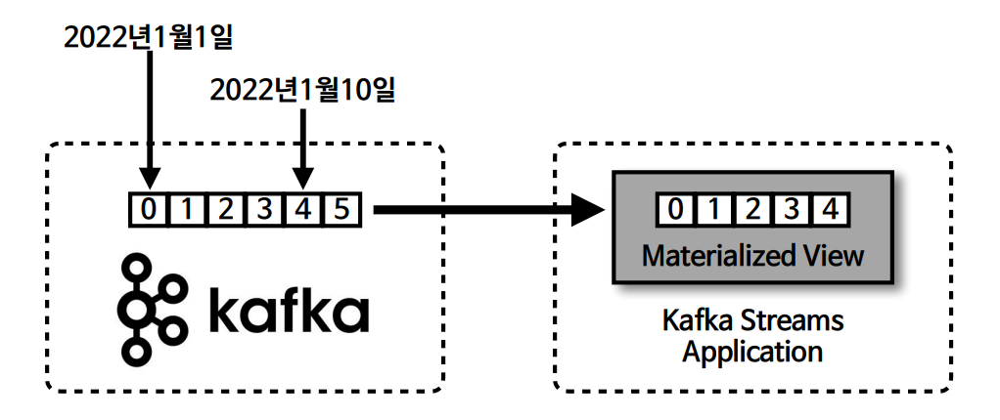

<br><br>

## 4. Kafka Producer
* kafka의 Producer는 데이터를 Kafka 클러스터로 전송하는 역할을 하는 클라이언트 애플리케이션
* 프로듀서는 데이터를 전송할 때, **리더 파티션**을 가지고 있는 카프카 브로커와 직접 통신한다.
* 프로듀서는 브로커로 데이터를 전송할 때 내부적으로 파티셔너, 배치 생성 단계(Accumulator)를 거침

<br>

### 4.1. Producer 내부 구조
* `ProducerRecord`: 프로듀서에서 생성하는 레코드. 오프셋은 포함되지 않음(클러스터에 저장될때 생성됨)
* `send()`: 레코드 전송 요청 메서드
* `Partitioner`: 어느 파티션으로 전송할지 지정하는 파티셔너. DefaultPartitioner가 기본 클래스
  * 파티셔닝 전략(파티셔너 클래스)에 따라 다르지만, 레코드는 기본적으로 키값에 의해 특정 파티션에 고정적으로 할당됨.
  * cf. 레코드의 복제는 다른 브로커에 이루어 짐. 즉, 해당 파티션의 레코드는 그 브로커 내에 하나만 존재하게 됨
* `Accumulator`: 배치로 묶어 전송할 데이터를 모으는 **버퍼**
  * 즉, send()할때마다 데이터를 보내는 것이 아니라 데이터를 묶어서 브로커로 전송하여 데이터 처리량을 높임
  * cf. producer.flush() 코드로 버퍼의 데이터를 바로 보내도록 할 수도 있음
* 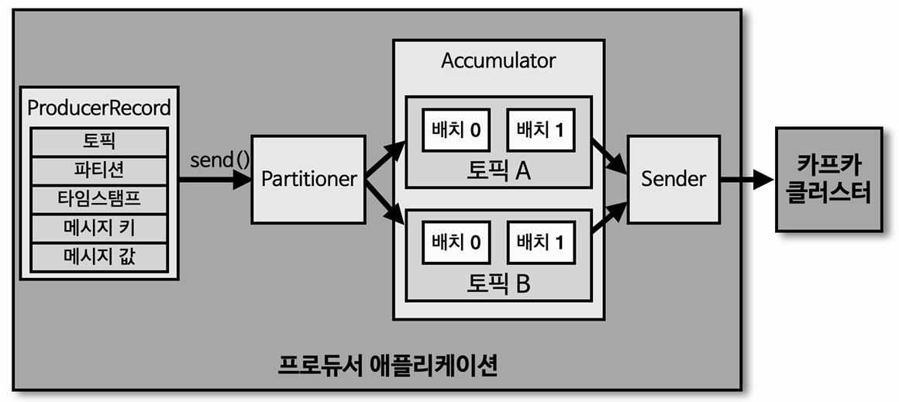

<br>

### 4.2. ISR과 acks 옵션 (Producer 옵션)
* [참고한 링크](https://techietalks.tistory.com/entry/Apache-Kafka-%EB%B8%8C%EB%A1%9C%EC%BB%A4-%EB%B3%B5%EC%A0%9C-ISR-%EC%9D%B4%EB%9E%80)
* 카프카에서는 하나의 토픽 파티션은 여러 브로커에 걸쳐 복제된다.
* 이는 데이터의 안정성을 보장하며, 특정 브로커 장애 발생 시 빠른 복구를 가능하게 한다. (고가용성)
* 리더 파티션과 팔로워 파티션?
  * 여러 브로커에 복제되어 저장되는 파티션은 각각 리더 또는 팔로워의 역할을 가짐
  * 프로듀서와 컨슈머는 오직 **리더 파티션**과만 직접 통신한다.
  * 팔로워 파티션은 리더 파티션의 데이터를 복제하여 저장한다. 
  * 팔로워 파티션에서는, 새로운 메시지가 있으면 리더로부터 데이터를 받아 동기화하는 작업이 필요함
* `ISR(In-Sync-Replicas)`
  * 팔로워 파티션은 리더 파티션과의 동기화 작업이 필요하기 때문에, 리더 파티션과 offset차이가 발생할 수 있다.
  * 이때, 리더 파티션과 팔로워 파티션이 모두 싱크가 된 상태를 ISR이라고 함
  * 아래 그림의 파티션을 보면 리더와 팔로워 파티션 모두 offset이 3으로 동일하므로 ISR 형태인 것임
  * 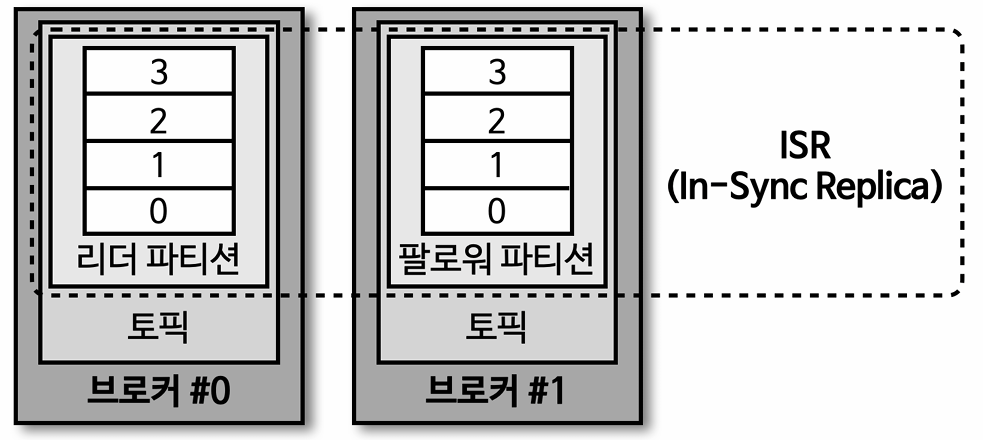
* `asks`
  * 신뢰성과 처리 속도 사이의 trade off를 결정하는 설정
  * acks(acknowledgments)는 프로듀서가 메시지를 브로커에 전송한 뒤,
    * 브로커로부터 "정상적으로 메시지가 저장되었다"는 확인(응답)을 어떤 수준까지 받을지 결정하는 옵션
  * 0, 1, all(-1) 값을 가질 수 있다.
    * `0`: 확인하지 않음 - 최고 속도, 데이터 유실 위험 큼, 데이터 유실 발생하더라도 전송 속도가 중요한 경우 사용
    * `1`: 리더 파티션 저장만 확인 - 리더 파티션에 적재되지 않았다면, 적재될 때까지 재시도 할 수 있다. 하지만 데이터 유실 가능
      * 일반적인 경우, 해당(1) 옵션을 사용함
    * `all(-1)`: 모든 ISR 복제 완료 시 승인 - 최고 신뢰성, 상대적으로 느림
      * `min.insync.replicas`: 최소 동기화 복제 파티션(ISR) 개수, 1로 설정시 acks = 1 설정과 동일하다고 볼 수 있음. 즉, 1로 설정시 리더 파티션만 적재 확인함
    * kafka 3.0 이상부터 **all**이 default 설정이지만, **min.insync.replicas = 1**이 default 설정이므로 acks=1과 비슷한 설정임

<br>

### 4.3. 멱등성 프로듀서 (Idempotence Producer)
* cf. 멱등성: 여러번 연산을 수행하더라도 동일한 결과를 나타내는 것
* 프로듀서가 보내는 데이터의 중복 적재를 막기 위해 프로듀서의 enable.idempotence 옵션을 true로 설정하여 멱등성 프로듀서로써 사용할 수 있다.
  * kafka 3.0 부터 `enable.idempotence = true`가 default
* 멱등성 프로듀서는 동일한 데이터를 여러번 전송하더라도 카프카 클러스터에 단 한번만 저장되도록 할 수 있다. (Exactly-once delivery)
* 어떻게 가능할까?
  * 멱등성 프로듀서는 기본 프로듀서와는 달리 레코드를 브로커로 전송할때, PID(Producer Unique Id)와 시퀀스 넘버(Sequence Number)를 함께 전달
  * 브로커는 PID와 Seq를 가지고 있다가 중복 적재 요청이 왔을때,적재되지 않도록 할 수 있다.
* 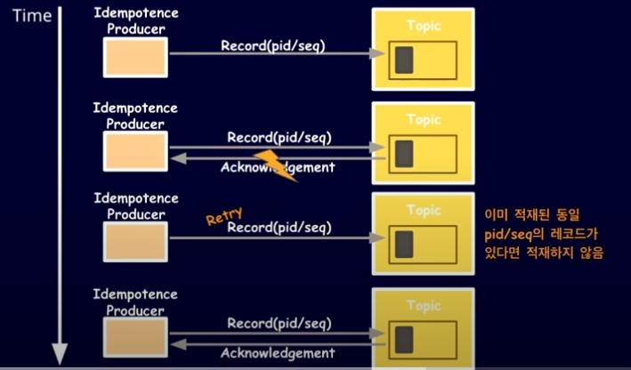

<br>

### 4.4 producer 코드 예시

#### 4.4.1. Producer 기본 사용법 예시 코드
  ```java
  KafkaProducer<String, String> producer = new KafkaProducer<>(configs);

  // Value만 전송하는 경우
  ProducerRecord<String, String> record = new ProducerRecord<>(TOPIC_NAME, "testMessage");
  producer.send(record);

  // (Key , Value) 전송하는 경우
  ProducerRecord<String, String> record2 = new ProducerRecord<>(TOPIC_NAME, "6", "Busan");
  producer.send(record2);

  // (partition번호 지정, key, Value) 전송하는 경우
  int partitionNo = 2;
  ProducerRecord<String, String> record3 = new ProducerRecord<>(TOPIC_NAME, partitionNo, "1", "Seoul");
  producer.send(record3);

  producer.flush(); // Accumulator(버퍼)의 데이터를 클러스터(토픽의 파티션)으로 전송하는 코드
  producer.close(); // Producer의 안전한 종료
  ```
#### 4.4.2. 커스텀 파티셔너를 가지는 Producer 예시 코드
* ex. "Pangyo"라는 value를 가진 메시지를 항상 0번 파티션으로 할당하는 CustomPartitioner 코드
  ```java
  public class CustomPartitioner  implements Partitioner {

      @Override
      public int partition(String topic, Object key, byte[] keyBytes, Object value, byte[] valueBytes, Cluster cluster) {
          if (keyBytes == null) {
              throw new InvalidRecordException("Need message key");
          }
          if (((String)value).equals("Pangyo")) // 값이 Pangyo일 경우
              return 0;

          // Pangyo아닌 경우 정상 처리
          List<PartitionInfo> partitions = cluster.partitionsForTopic(topic);
          int numPartitions = partitions.size();
          return Utils.toPositive(Utils.murmur2(keyBytes)) % numPartitions;
      }

      @Override
      public void configure(Map<String, ?> configs) {}

      @Override
      public void close() {}
  }
  ```
* CustomPartitioner를 Partitioner로 변경하는 코드
  ```java
  Properties configs = new Properties();
  // 위에서 정의한 CustomPartitioner를 파티셔너로 할당
  configs.put(ProducerConfig.PARTITIONER_CLASS_CONFIG, CustomPartitioner.class);

  KafkaProducer<String, String> producer = new KafkaProducer<>(configs);
  ProducerRecord<String, String> record = new ProducerRecord<>(TOPIC_NAME, "2", "Pangyo"); // 해당 레코드는 0번 파티션으로...

  producer.send(record);
  producer.flush();
  producer.close(); // 프로듀서의 안전한 종료
  ```

#### 4.4.3. Producer의 Metadata 출력하기
* producer.send(record).get() 으로 producer의 config 정보 받을 수 있음
  ```java
  // ...
  KafkaProducer<String, String> producer = new KafkaProducer<>(configs);
  ProducerRecord<String, String> record = new ProducerRecord<>(TOPIC_NAME, "2", "Pangyo");

  // ...
  try {
      RecordMetadata metadata = producer.send(record).get(); // producer의 config 정보 받기
      // logger.info(metadata.toString()); // 확인용 코드
  } catch (Exception e) {
      logger.error(e.getMessage(),e); // 문제가 생겼을때만 로그 남기는게 일반적임
  } finally {
      producer.flush();
      producer.close();
  }
  ```

<br><br>

## 5. Kafka Consumer
* Producer가 전송한 데이터는 Kafka 브로커에, 정확히는 토픽 내의 특정 파티션에 적재되는데,
* 컨슈머는 적재된 데이터를 사용하기 위해 브로커로부터 데이터를 가져와 처리한다.
* 컨슈머는 데이터를 가져올 때, **리더 파티션**을 가지고 있는 카프카 브로커와 직접 통신한다.

<br>

### 5.1. Consumer Group
* 컨슈머 그룹은 카프카의 컨슈머 인스턴스들을 하나로 묶는 논리적 그룹 단위 이다.
  * 컨슈머들은 토픽을 구독하여, 토픽의 1개 이상의 파티션들에 할당되어 데이터를 가져갈 수 있다.
  * 파티션과 컨슈머는 N:1 로 할당 가능하다. 따라서 컨슈머의 개수는 파티션의 개수와 같거나 적어야 한다.
    * 컨슈머 개수가 더 많아지는 경우, Idle 상태로 분류되고 스레드를 차지하므로 불필요한 리소스에 해당
    * 따라서 아래 그림과 같이 컨슈머를 할당하며, 파티션과 컨슈머가 1:1로 대응되는 경우 리소스를 더 많이 차지하지만 처리속도가 가장 빠른 형태에 해당
    * cf. **컨슈머와 파티션의 개수를 같게 하여 컨슈머와 파티션을 1:1로 할당하여 사용하는 것이 일반적인 방법**
  * 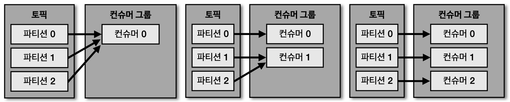

#### 5.1.1. Consumer Group 왜 필요할까?
* `fail over - Rebalancing`: 특정 Consumer에 장애가 발생해도 동일 그룹 내의 다른 Consumer가 남은 파티션을 자동으로 할당받아 데이터를 계속 소비할 수 있다.
  * 리밸런싱(rebalancing): 컨슈머가 추가되거나 장애 상황으로 컨슈머가 제외되는 상황에서, 파티션의 소유권을 새로운, 또는 다른 컨슈머에게 이관하는 조정 작업
* `병렬 처리`: 하나의 Consumer Group 내에 여러 Consumer Instance를 두면, 파티션을 여러 Consumer가 나눠서 읽을 수 있어서 데이터 처리 속도가 증가
  * ex. 아래 그림에서, 하둡 적재 컨슈머 그룹
* `Offset 관리 단일화`: Consumer Group마다 토픽에 대한 Offset을 별도로 저장하므로, 여러 Group이 동일한 Topic을 읽더라도 서로 영향을 주지 않고 독립적으로 데이터를 소비
* `다양한 용도별 데이터 소비`: 동일한 Topic에 여러 Consumer Group이 붙을 수 있고 필요에 따라 컨슈머의 개수를 다르게 적용 가능함
  * ex. 아래 그림에서와 같이, 그룹마다 다른 형태로 데이터가 적재되도록 소비할 수 있다.
  * 또한, 즉각적인 데이터 처리가 필요하다면 컨슈머 개수를 최대한으로 늘려 처리 속도를 올리거나 그렇지 않은 경우라면 컨슈머를 줄여 리소스를 절약할 수 있다.
  * **컨슈머와 파티션의 개수를 같게 하여 컨슈머와 파티션을 1:1로 할당하여 사용하는 것이 일반적인 방법**
* 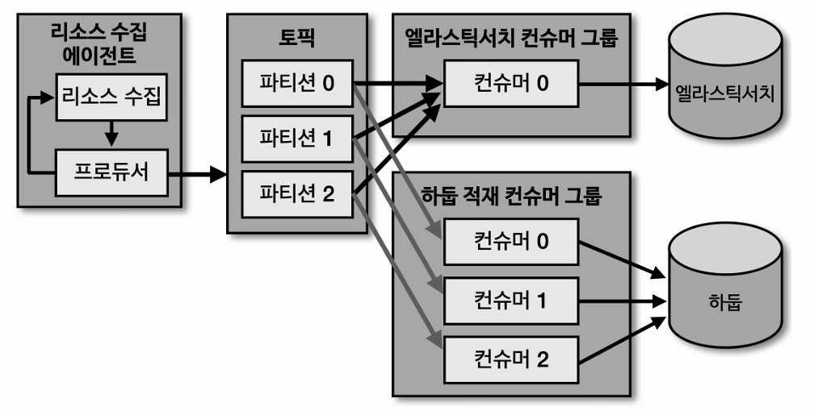

<br>

### 5.2. 커밋(commit)과 오프셋(offset)
* 컨슈머가 poll()을 호출할 때마다 Consumer Group은 카프카에 저장되어 있는 아직 읽지 않은 메시지를 가져온다.
* 이렇게 동작할 수 있는 이유는, 컨슈머 그룹이 메시지를 어디까지 가져갔는지 알 수 있도록 offset을 기록하기 때문
* `offset`이란 어디까지 데이터를 읽었는지에 대한 위치 정보이다.
* 토픽의 리더 Partition에 있는 n번째 레코드를 Consumer Group이 `poll()`하여 처리후 `commit()`하게 되면,
* 토픽 내부의 `offset`에 기록되어 어디까지가 처리된 데이터인지 확인할 수 있다.
* 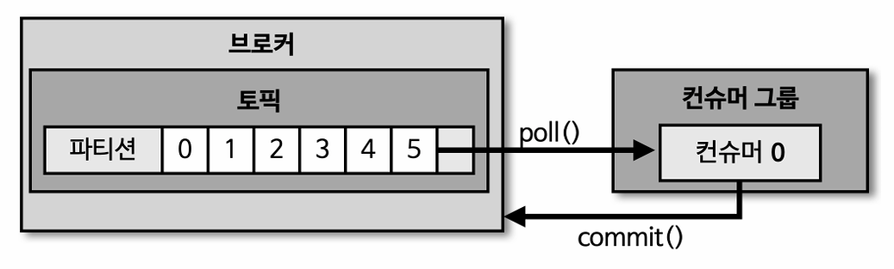

<br>

### 5.3. auto-offset-reset
* 컨슈머 그룹이 특정 파티션을 읽을 때, 커밋된 컨슈머 오프셋이 없는 경우 어디부터 데이터를 읽을지 선택하는 옵션
* `latest`: 가장 최근에 적재된 데이터부터 읽기 시작함
* `earliest`: 가장 오래된 오프셋부터 읽기 시작함
* 커밋 기록이 있는 경우 `auto-offset-reset`옵션은 무시된다.
* 따라서 특별한 경우가 아니라면 earliest로 설정하는 것이 좋다.
  * 예를들어 파티션을 늘리는 경우, 처음 데이터부터 처리되기를 기대하는 것이 일반적이다.
  * **기본 값이 latest이므로 earliest로 꼭 명시해 주는 것이 좋다.**

<br>

### 5.4. 컨슈머의 세션 타임아웃과 안전한 종료
* 컨슈머가 코드 상에서 명시적으로 종료되지 않거나, 장애가 생겨 **하트비트(heartbeat)**를 전송하지 못한다면
  * 세션 타임아웃(`session.timeout.ms`)이 발생할 때까지 컨슈머 그룹에 남아있게 된다.
* 컨슈머는 주기적으로 그룹 코디네이터(브로커)에게 하트비트를 전송하여 활성 상태를 유지
* 하트비트 주기(`heartbeat.interval.ms`)는 기본값 3초로 제어되며, 아래의 조건이 충족되지 않으면 컨슈머는 그룹에서 제거됨
  * session.timeout.ms(기본값 45초) 내에 최소 한 번의 하트비트 전송 - kafka 4.0.0 기준
  * 컨슈머 장애 시 최대 45초간 데이터 처리 중단 발생 가능하다는 것을 의미함
  * `session.timeout.ms`과 `heartbeat.interval.ms`의 시간은 설정 가능함 (ms기준 주의)
* 컨슈머를 코드 상에서 명시적으로 종료하려면, `KafkaConsumer.close()` 메서드를 호출해야 한다.
  * Shutdown Hook & Wakeup 이용하여 컨슈머 종료 시키기
  * 코드 - `5.6.5.` 항목 참고

<br>

### 5.5. 멀티 프로세스, 멀티 스레드 컨슈머
* 기본적으로 하나의 컨슈머는 하나의 스레드로 동작한다.
* k8s 환경에서는 아래 그림의 그룹 A와 같이 1개의 스레드를 가지는 프로세스(Pod)를 여러개 띄워서 멀티 프로세서 환경으로 운영이 가능
  * 고가용성이지만 멀티 스레드(B그룹) 방식과 비교하여 자원 소모가 크다
* `kafka.listener.concurrency` 옵션을 이용하여 오른쪽 그림과 같이 멀티 스레드 환경으로도 운영이 가능하다.
  * 자원 효율성이 높지만 특정 컨슈머에 장애 발생시 다른 컨슈머에도 영향이 감
* 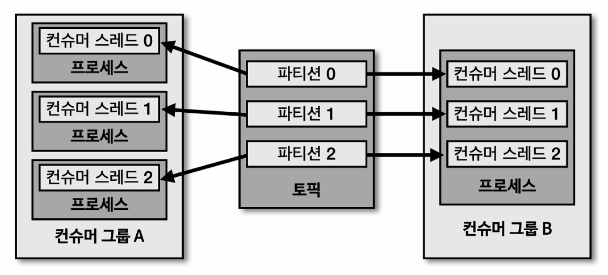
* 추가로, 1개의 애플리케이션에 1개 컨슈머 스레드를 실행시키고,
* 해당 애플리케이션이 실행되는 pod를 여러개 운영하는 방식이 실무에서 가장 많이 사용되는 방식이라고 함

<br>

### 5.6. Consumer Lag
* 컨슈머 랙(Lag)은 파티션의 최신 오프셋(Log-end-offset)과 컨슈머 오프셋(current-offset)간의 차이이다.
* 컨슈머 랙의 개수?
  * 컨슈머 랙은 그룹과 토픽, 파티션별로 생성된다. 
  * 2개의 토픽에 각각 3개의 파티션이 있고 컨슈머 그룹이 2개씩 있다면?
  * 컨슈머 랙의 총 개수 = 2(토픽) x 2(그룹) × 3(파티션) = 12개
* 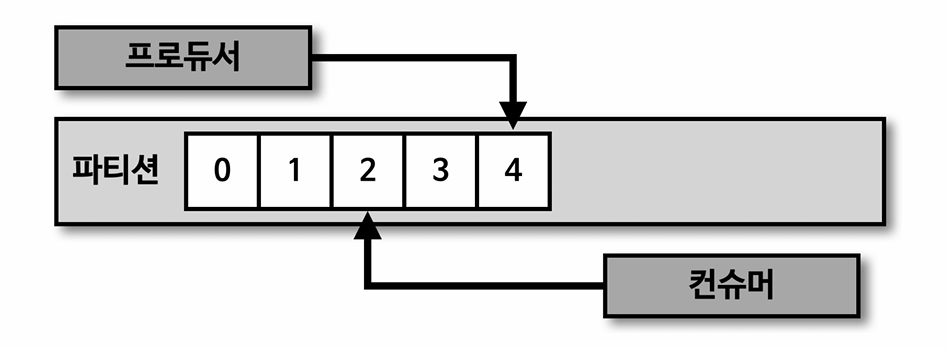
* 컨슈머 랙의 최솟값(개수 말고..)은 0으로 지연이 없음을 뜻한다.
* 프로듀서의 데이터양이 늘어날 경우, 컨슈머 랙이 늘어날 수 있다.
* 파티션 개수와 컨슈머 개수를 늘려 병렬 처리량을 높여 컨슈머 랙을 줄일 수 있다.
  * cf. 컨슈머 최대 개수는 파티션의 개수이므로, 컨슈머와 파티션 개수가 같다면 파티션을 늘려야 처리량을 높일 수 있다.
* 컨슈머의 장애로 컨슈머 랙이 증가할 수도 있다.
  * ex. 프로듀서가 보내는 데이터양은 일정한데, 파티션 2번의 컨슈머 랙이 늘어나는 상황이 발생한다면 2번 파티션에 할당된 컨슈머의 장애를 의심

#### 5.6.1. Consumer Lag Monitoring
* 명령어로 확인하기
  ```sh
  kafka-consumer-groups.sh --bootstrap-server <브로커주소>:9092 --group <그룹명> --describe
  ```
* Kafka Consumer Lag 모니터링 도구 사용하기
  * Burrow, Kafka Exporter, Kafka Lag Exporter와 같은 도구를 사용하여 모니터링 할 수 있음
    * `Burrow`: Consumer Lag에 특화된 모니터링
    * `Kafka Exporter`: 간단한 설정으로 Prometheus & Grafana와 통합, Kafka의 전반적인 상태와 함께 Consumer Lag도 모니터링
    * `Kafka Lag Exporter`: Lag의 시간(초단위) 측정과 Kubernetes 환경 통합, 단 다소 높은 리소스 사용량
  * Prometheus 및 Grafana와 통합하여 데이터 시각화도 가능함

<br>

### 5.6. Consumer 코드 예시

#### 5.6.1. 동기 오프셋 커밋 컨슈머 - 자동 커밋
* auto commit 설정 코드임
* N초마다 처리할 데이터들을 모아 Commit할 수 있음
* 코드
  ```java
  configs.put(ConsumerConfig.ENABLE_AUTO_COMMIT_CONFIG, true); // default 설정도 true임
  configs.put(ConsumerConfig.AUTO_COMMIT_INTERVAL_MS_CONFIG, 60000); // 60초마다 자동 커밋 설정

  KafkaConsumer<String, String> consumer = new KafkaConsumer<>(configs);
  consumer.subscribe(Arrays.asList(TOPIC_NAME));

  while (true) {
      // poll 하고나서 데이터 처리후 자동 커밋함
      ConsumerRecords<String, String> records = consumer.poll(Duration.ofSeconds(1));
      // 데이터 처리
      for (ConsumerRecord<String, String> record : records) {
          logger.info("record:{}", record);
      }
  }
  ```


#### 5.6.2. 동기 오프셋 커밋 컨슈머 - 레코드 단위 커밋
* Commit요청시 Consumer와 Broker가 통신하는 과정이 필요하기 때문에, Commit을 너무 자주하면 데이터 처리 속도가 느려지고 Broker에도 부담이 가게 됨
  * `consumer.commitSync(offset);` 코드에서 브로커로 커밋 요청을 하고 커밋이 완료되었는지 응답을 받아야 하기 때문
  * 일반적으로는 많이 사용하지 않는 방식임, 초당 100개의 데이터를 처리하는 정도라면 괜찮다고 함
* 코드
  ```java
  // 자동 커밋 false로 설정
  configs.put(ConsumerConfig.ENABLE_AUTO_COMMIT_CONFIG, false); 

  KafkaConsumer<String, String> consumer = new KafkaConsumer<>(configs);
  consumer.subscribe(Arrays.asList(TOPIC_NAME));

  while (true) {
      ConsumerRecords<String, String> records = consumer.poll(Duration.ofSeconds(1));
      // 데이터 처리
      for (ConsumerRecord<String, String> record : records) {
          logger.info("record:{}", record);
      }
      // 자동 커밋과 다르게, 커밋 코드를 작성
      consumer.commitSync();
  }
  ```

#### 5.6.3. 비동기 오프셋 커밋 컨슈머
* `.commitAsync()` 메소드로 비동기 오프셋 커밋을 하고
* `OffsetCommitCallback`로 콜백에 대한 처리를 정의할 수 있음
* 코드
  ```java
  // 자동 커밋 false로 설정
  configs.put(ConsumerConfig.ENABLE_AUTO_COMMIT_CONFIG, false);

  KafkaConsumer<String, String> consumer = new KafkaConsumer<>(configs);
  consumer.subscribe(Arrays.asList(TOPIC_NAME));

  while (true) {
      ConsumerRecords<String, String> records = consumer.poll(Duration.ofSeconds(1));
      // 데이터 처리
      for (ConsumerRecord<String, String> record : records) {
          logger.info("record:{}", record);
      }
      // 동기 오프셋 커밋과 다르게, `.commitAsync()` 메소드를 사용하고 OffsetCommitCallback으로 콜백 정의 해주어야 함
      consumer.commitAsync(new OffsetCommitCallback() {
          public void onComplete(Map<TopicPartition, OffsetAndMetadata> offsets, Exception e) {
              if (e != null)
                  System.err.println("Commit failed");
              else
                  System.out.println("Commit succeeded");
              if (e != null)
                  logger.error("Commit failed for offsets {}", offsets, e);
          }
      });
  }
  ```

#### 5.6.4. 리밸런스 리스너를 가지는 컨슈머
* **리밸런스 발생을 감지**하기 위해 카프카 라이브러리는 ConsumerRebalanceListener 인터페이스를 지원
  * `onPartitionsAssigned()`: 파티션이 할당 완료되어 리밸런스가 끝난 뒤 호출
  * `onPartitionsRevoked()`: 리밸런스가 시작되기 직전에 호출
* 코드 예시
  ```java
  @Slf4j
  public class RebalanceListener implements ConsumerRebalanceListener {

      public void onPartitionsAssigned(Collection<TopicPartition> partitions) {
          log.warn("Partitions are assigned : " + partitions.toString());

      }

      public void onPartitionsRevoked(Collection<TopicPartition> partitions) {
          log.warn("Partitions are revoked : " + partitions.toString());
      }
  }
  ```
  ```java
  KafkaConsumer<String, String> consumer = new KafkaConsumer<>(configs);
  // 컨슈머에 위에서 구현한 RebalanceListener 할당
  consumer.subscribe(Arrays.asList(TOPIC_NAME), new RebalanceListener());
  while (true) {
      ConsumerRecords<String, String> records = consumer.poll(Duration.ofSeconds(1));
      for (ConsumerRecord<String, String> record : records) {
          logger.info("{}", record);
      }
  }
  ```

#### 5.6.5. 컨슈머 App의 안전한 종료
* 컨슈머 애플리케이션은 안전하게 종료되어야 한다.
* 정상적으로 종료되지 않은 컨슈머는 세션 타임아웃(`5.4.` 항목 참고)이 발생 할때까지 컨슈머 그룹에 남게된다.
* KafkaConsumer클래스는 `wakeup()`메서드를 지원하는데, 해당 메서드가 실행된 후 `poll()`메서드 호출시 WakeupException을 발생시킬 수 있다.
  * JVM이 종료 신호를 받으면 ShutdownThread가 실행되는데 해당 스레드에서 wakeup() 메소드가 호출될 수 있다.
  * 이후, 메인 루프의 poll()이 WakeupException을 발생시킨다.
  * 예외를 발생시킨 후에는 자원들을 안전하게 종료시키면 된다.
* 코드 예시 (Consumer 클래스 전체 코드)
  ```java
  public class ConsumerWithSyncOffsetCommit {
      private final static Logger logger = LoggerFactory.getLogger(ConsumerWithSyncOffsetCommit.class);
      private final static String TOPIC_NAME = "test";
      private final static String BOOTSTRAP_SERVERS = "my-kafka:9092";
      private final static String GROUP_ID = "test-group";
      private static KafkaConsumer<String, String> consumer;

      public static void main(String[] args) {
          // ShutdownHook 추가
          // ShutdownThread는 아래에 정의 - JVM이 종료 신호를 받으면 ShutdownThread가 실행됨
          Runtime.getRuntime().addShutdownHook(new ShutdownThread());

          Properties configs = new Properties();
          configs.put(ConsumerConfig.BOOTSTRAP_SERVERS_CONFIG, BOOTSTRAP_SERVERS);
          configs.put(ConsumerConfig.GROUP_ID_CONFIG, GROUP_ID);
          configs.put(ConsumerConfig.KEY_DESERIALIZER_CLASS_CONFIG, StringDeserializer.class.getName());
          configs.put(ConsumerConfig.VALUE_DESERIALIZER_CLASS_CONFIG, StringDeserializer.class.getName());
          configs.put(ConsumerConfig.ENABLE_AUTO_COMMIT_CONFIG, false);

          consumer = new KafkaConsumer<>(configs);
          consumer.subscribe(Arrays.asList(TOPIC_NAME));

          try {
              while (true) {
                  ConsumerRecords<String, String> records = consumer.poll(Duration.ofSeconds(1));
                  for (ConsumerRecord<String, String> record : records) {
                      logger.info("{}", record);
                  }
                  consumer.commitSync();
              }
          } catch (WakeupException e) {
              logger.warn("Wakeup consumer");
          } finally {
              logger.warn("Consumer close");
              consumer.close(); // 안전한 종료
          }
      }

      static class ShutdownThread extends Thread {
          public void run() {
              logger.info("Shutdown hook");
              consumer.wakeup(); // wakeup() 메소드 호출
          }
      }
  }
  ```

<br><br>

## 6. Transaction Producer와 Consumer
* Transaction Producer와 Consumer를 설명하기 전에,
  * Transaction Producer는 내부적으로 Idempotence Producer와 동일한 로직으로 운영되며,
  * 트랜잭션 레코드(시작/커밋/어보트 등)를 추가로 전송
* 다수의 파티션에 데이터를 저장해야 하는 경우, `Transaction Producer`를 사용하여 하나의 Transaction으로 묶어서(atomic단위로 묶어서) 처리할 수 있다.
  * 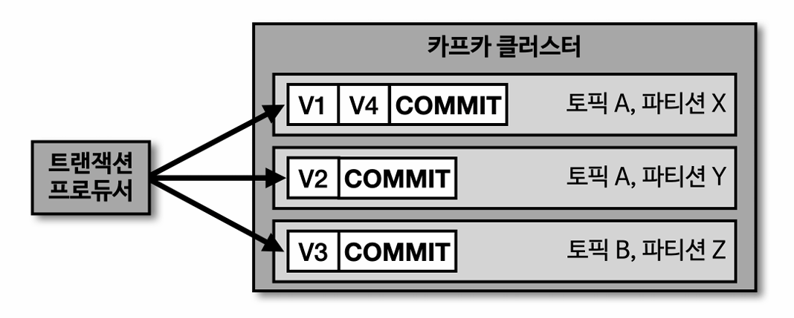
* 이때, `Transaction Consumer`는 트랜잭션이 완료되어 Commit된 데이터를 확인하고 데이터를 가져간다.
  * 아래의 그림을 보면, 트랜잭션 컨슈머가 파티션의 트랜잭션 레코드 Commit 기록을 확인하고 데이터를 가져가는 모습
  * 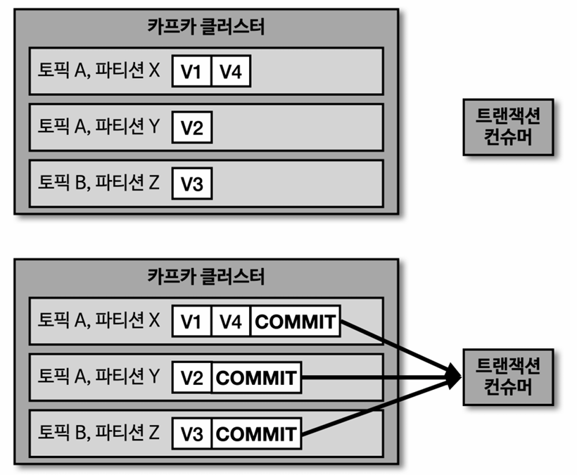
* Transaction Producer 생성 코드 예시
  ```java
  // Transaction id 설정 -> UUID와 같이 고유한 값 사용
  configs.put(ProducerConfig.TRANSACTIONAL_ID_CONFIG, UUID.randomUUID());

  Producer<String, String> producer = new KafkaProducer<>(configs); 
  producer.initTransactions(); // 트랜잭션 초기화

  producer.beginTransaction(); // 트랜잭션 시작
  // 하나의 트랜잭션내에 여러 토픽의 데이터 전송 가능
  producer.send(new ProducerRecord<>(TOPIC_1, "전달하는 메시지 값 1"));
  producer.send(new ProducerRecord<>(TOPIC_2, "전달하는 메시지 값 2"));
  producer.commitTransaction(); // 트랜잭션 완료(커밋)

  producer.close(); // 안전한 프로듀서 종료
  ```
* Transaction Consumer 생성 코드 예시
  ```java
  // Transaction Consumer 설정 - read_committed로 변경
  configs.put(ConsumerConfig.ISOLATION_LEVEL_CONFIG, "read_committed"); // 기본값 - read_uncommitted
  KafkaConsumer<String, String> consumer = new KafkaConsumer<>(configs);
  ```

<br><br>

## 7. Kafka Streams
* Kafka Streams는 kafka의 **topic의 데이터**를 읽고 **변환 처리**한 후 그 결과를 kafka의 **topic에 저장**하는 작업을 해줌
* 출처 - [confluent 공식 문서](https://docs.confluent.io/platform/current/streams/architecture.html)
* Kafka Streams API를 사용하는 애플리케이션의 구조
  * 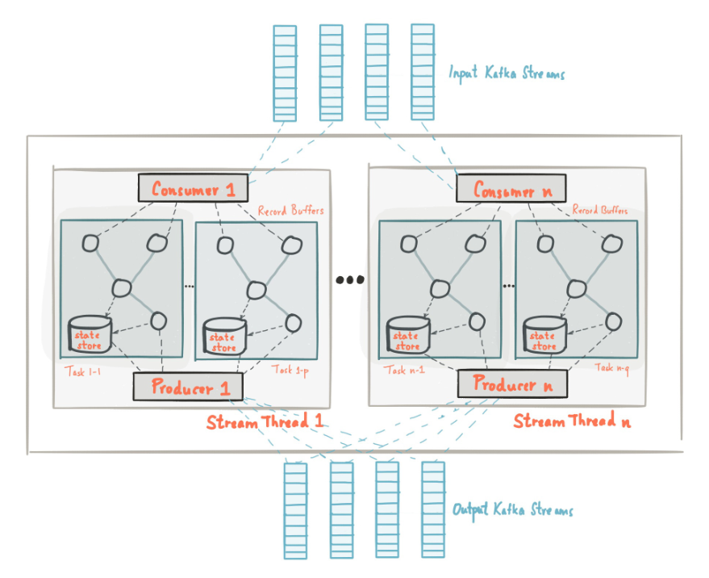

<br>

### 7.1. Kafka Streams란 ?
  * Apache Kafka 기반의 실시간 데이터 처리를 위한 자바 라이브러리
  * Kafka 토픽에서 데이터를 읽고(Source Processor), 변환 or 가공 처리한 후(Stream Processor), Kafka 토픽으로 결과를 저장(Sink Processor) 작업을 수행
  * Kafka Streams는 별도의 클러스터를 필요로 하지 않고, 라이브러리 형태로 일반 Java 애플리케이션을 통해 구현 가능

<br>

### 7.2. Kafka Streams 구조 ?
* Kafka Streams 는 Tree형 Topology 구조를 가짐, DAG임
* 노드를 `Processor`, 간선을 `Stream` 이라고 부름
* 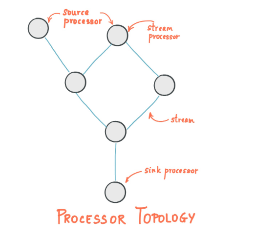
* `Processor` ?
  * `소스 프로세서(Source Processor)`
    * 소스 프로세서는 Kafka 토픽에서 데이터를 읽어오는 시작점이다.
    * 하나 이상의 Kafka 토픽을 구독하고, 레코드를 스트림 처리 파이프라인으로 전달
  * `스트림 프로세서(Stream Processor)`
    * 스트림 프로세서는 데이터 변환, 필터링, 집계 등의 비즈니스 로직을 수행하는 핵심 컴포넌트
    * 강력한 Stateful, Stateless 프로세싱 기능이 들어 있어 카프카의 토픽 데이터 처리시 선택하여 처리 가능
      * stateless ex. map(레코드 변환), filter(레코드 조건 필터링) 등
      * stateful ex. windowed(시간 기반 윈도우 집계), join(스트림/테이블 조인) 등
  * `싱크 프로세서(Sink Processor)`
    * 싱크 프로세서는 처리된 데이터를 Kafka 토픽 또는 외부 시스템에 쓰는 종착점
    * 다운스트림 프로세서가 없으며, 최종 결과를 출력함
    * 즉, 최종 처리된 데이터를 어떤 토픽에 저장하는 역할을 함

<br>

### 7.3. kafka Producer와 Consumer를 이용하면 되는 내용인데 Kafka Streams를 쓰는 이유?
* `실시간 데이터 처리` - Kafka 공식 Java 라이브러리로, 실시간 데이터 처리(필터, 변환, 집계, 조인 등)를 손쉽게 구현 가능
  * 여러 Producer/Consumer 조합으로 처리하던 복잡한 구조를 Kafka Streams를 이용하여 단순화
* `부하 분산` - 내부적으로 파티션 단위로 작업을 분산 처리하고, 여러 인스턴스를 실행하면 자동으로 파티션을 나눠 병렬로 처리
* `failover 및 확장성` - 장애 발생 시 상태 저장소를 기반으로 자동 복구 및 재처리가 가능, 인스턴스를 추가하면 자동으로 파티션이 재분배되어 수평 확장이 용이
* `시간 기반 윈도우 연산` - 이벤트 타임, 처리 타임 등 다양한 시간 기반 윈도우 연산(예: 5분 집계, 슬라이딩 윈도우 등)을 지원
  * 단순 Consumer로는 구현이 어려움
* `상태 저장` - 로컬 RocksDB 등으로 상태를 직접 저장하며, Kafka 내부 토픽을 통해 장애 복구 및 정확성을 보장
  * 별도의 cluster 필요 없이 애플리케이션 단위로 내장 실행
* `Exactly-once 처리 보장` - 메시지의 중복 처리나 누락 없이 정확히 한 번만 처리하는 것을 보장

<br>

### 7.4. Streams DSL(Domain Specific Language)란?
* [참고 링크](https://goslim56.tistory.com/29)
* 미리 제공되는 함수들을 이용하여 **토폴로지를 정의**하는 방식
* 이벤트 기반 데이터 처리에 필요한 기능들을 제공하기 때문에 스트림즈를 구현하기 편함
* 대부분의 변환 로직을 어렵지 않게 개발할 수 있도록 스트림 프로세싱에 쓰일만한 다양한 기능들을 자체 API로 제공
  * 이벤트 기반 데이터 처리를 할 때 필요한 다양한 기능들(map, join, window 등)을 대부분 제공
* application id로 Streams App을 구분하여 데이터 작업을 처리함
  * `application.id`: consumer의 Group Id와 동일한 역할로 Streams App을 구분하기 위한 고유 Id에 해당
* Streams DSL에는 스트림 데이터 처리를 위한, 추상화 개념인 KStream, KTable, GlobalKTable이 있음
  * `KStream, KTable, GlobalKTable`으로 구현된 Stream DSL 코드는 하나의 Topology 객체로 통합됨
  * spring boot를 예시로, Stream DSL 코드로 구현한 Bean객체가 여러개라도 Kafka Streams에 의해 하나의 Topology로 통합
  * 따라서, 모든 스트림 처리가 같은 Kafka Streams 인스턴스에서 관리될 수 있음
* Stream DSL 로직은 언제 동작?
  * Stream DSL 로직에 사용된 Topic을 구독하여, 해당 Topic에 메시지가 생성(브로커 Commit)되면 해당 Stream 처리 로직이 자동 트리거
  * 코드 예시
    ```java
    @Service
    public class OrderStreamService {
        // ...

        @Bean
        public KStream<String, String> orderJoinAddressStream(StreamsBuilder streamsBuilder) {
            KTable<String, String> addressTable = streamsBuilder.table(ADDRESS_TABLE); // ADDRESS_TABLE을 KTable로 로드
            KStream<String, String> orderStream = streamsBuilder.stream(ORDER_STREAM); // ORDER_STREAM을 KStream으로 로드
            KStream<String, String> joinedStream = orderStream.join(
                addressTable,
                (order, address) -> order + " send to " + address
            );
            
            joinedStream.to(ORDER_JOIN_STREAM);
            return joinedStream;
        }

        @Bean
        public KStream<String, String> filterLogStream(StreamsBuilder streamsBuilder) {
            // ....
        }

        // ...
    }
    ```

#### 7.4.1. Streams DSL의 stateful 프로세싱, stateless 프로세싱
* Streams DSL는 실시간 데이터 처리를 위해 Stateful과 Stateless 연산(API)을 제공
* cf. Streams DSL에서 제공하는 연산 이외의 커스텀 연산이 필요하다면 Processor API를 사용해야 함
* Stateful 데이터 처리에 강함 (Streams는 상태를 유지해야 하는 복잡한 연산에 적합)
  * count: 키별 레코드 수 집계 - `stream.groupByKey().count()`
  * reduce: 키별 값 누적 연산 - `stream.groupByKey().reduce((v1, v2) -> v1 + v2)`
  * aggregate: 사용자 정의 초기값 + 집계 - `stream.groupByKey().aggregate(() -> 0L, (k, v, agg) -> agg + v.length())`
  * windowed: 시간 기반 윈도우 집계 ex.5분 간격 매출 계산 - `stream.groupByKey().windowedBy(TimeWindows.of(Duration.ofMinutes(5))).count()`
  * join: 스트림/테이블 조인 - `stream.join(otherStream, (v1, v2) -> v1 + v2, JoinWindows.of(Duration.ofSeconds(10)))`
* stateless 데이터 처리도 가능 (단순 변환 작업도 지원)
  * filter:	조건에 맞는 레코드만 필터링	- `stream.filter((k, v) -> v > 100)`
  * map: 레코드 변환 - `stream.mapValues(v -> v.toUpperCase())`
  * flatMap: 레코드를 여러 개로 분할 - `stream.flatMapValues(v -> Arrays.asList(v.split(" ")))`
  * branch: 조건별로 스트림 분기 - `KStream<String, String>[] branches = stream.branch(pred1, pred2)`
  * merge: 여러 스트림을 하나로 병합 - `stream1.merge(stream2)`

#### 7.4.2. KStream, KTable, GlobalKTable ?
* Streams DSL에는 스트림 데이터 처리를 위해, 레코드의 흐름을 추상화한 3가지 개념인 KStream, KTable, GlobalKTable이 있다.
  * 해당 3가지 개념은 Streams DSL에서만 사용되는 개념으로 각각의 특성에 맞게 데이터를 가공하고 조회할 수 있다.
  * ex. KTable 이용시 key에 대한 최신 데이터를 추가, 조회가 가능
  * consumer가 트리거 되는 방법과 같이, Stream 처리에 사용된 Topic에 메시지가 Commit되면 해당 Stream 로직이 자동 트리거
* `KStream`
  * 이벤트 스트림을 연속적인 레코드 시퀀스로 모델링
  * 모든 레코드를 개별 처리하며 stateless 연산에 적합
  * **컨슈머로 토픽을 구독하여 데이터를 하나씩 처리하는 것과 동일**하다고 보면 됨
  * 따라서 Topic의 모든 레코드를 조회할 수 있다.
  * 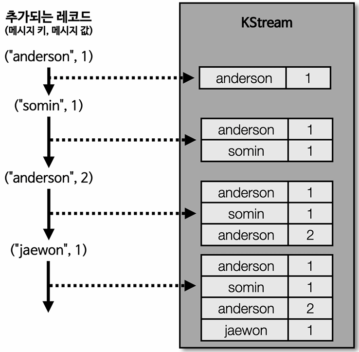
* `KTable`
  * KTable은 **메시지 키를 기준으로 최신 값만 유지**하는 방식(upsert 방식)
  * KTable은 Streams App의 Task내에 matrialized view로 저장되어 토픽으로 활용될 수 있다.
  * matrialized view 란?
    * 더 빠른 데이터 검색을 위해 여러 기존 테이블의 데이터를 결합하여 생성되는 중복 데이터 테이블
    * Streams App의 Task(스레드) 내에 RocksDB 같은 Key-Value Store가 생성되어, KTable의 상태가 저장됨
    * 이 로컬 스토어가 materialized view에 해당하며 필요할 때 즉시 조회가 가능
    * 즉, 토픽의 최신 상태를 Key-Value 형태로 메모리 또는 디스크에 저장해두는 것임
  * 아래 이미지를 보면 KStream 방식과는 다르게 (anderson, 2)라는 레코드 추가 처리시 anderson 키에 대한 값을 2로 업데이트하여 최신 값 유지
    * cf. 값이 null이면 해당 키의 데이터는 삭제로 간주됨
  * 즉, topic의 데이터를 key-value store처럼 사용하는 것이 KTable이고
  * KTable로 데이터 조회시 key에 대한 최신의 레코드의 데이터를 조회할 수 있다.
  * 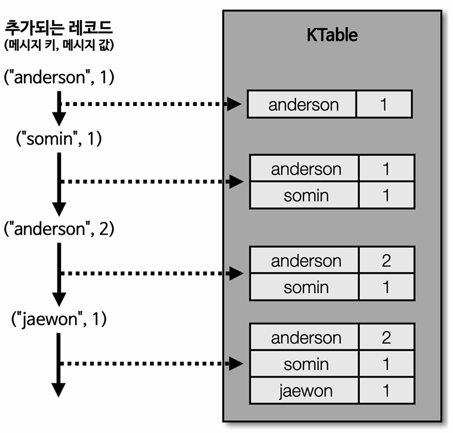
* `코파티셔닝 (co-partitioning)` - KStream과 KTable의 Join
  * **KStream과 KTable을 조인**하려면 반드시 코파티셔닝되어 있어야 한다.
  * 코파티셔닝이란 토픽들이 아래의 조건을 만족할 때, 해당 토픽들은 코파티셔닝이라고 볼 수 있다.
    * 동일한 파티션 수
    * 동일한 파티셔닝 전략 (`4.1.`와 `4.4.2.` 참고)
      * cf. 파티셔너 - key에 따라서 어느 Partition으로 갈지 정해주는 역할을 함
  * 코파티셔닝을 만족한다면 **특정 key에 대한 데이터가 동일한 파티션에 들어가는 것**을 보장할 수 있고,
    * Join대상 토픽들로부터, **동일한 메시지 키를 가진 데이터가 동일한 태스크에 들어가는 것을 보장**할 수 있다.
  * 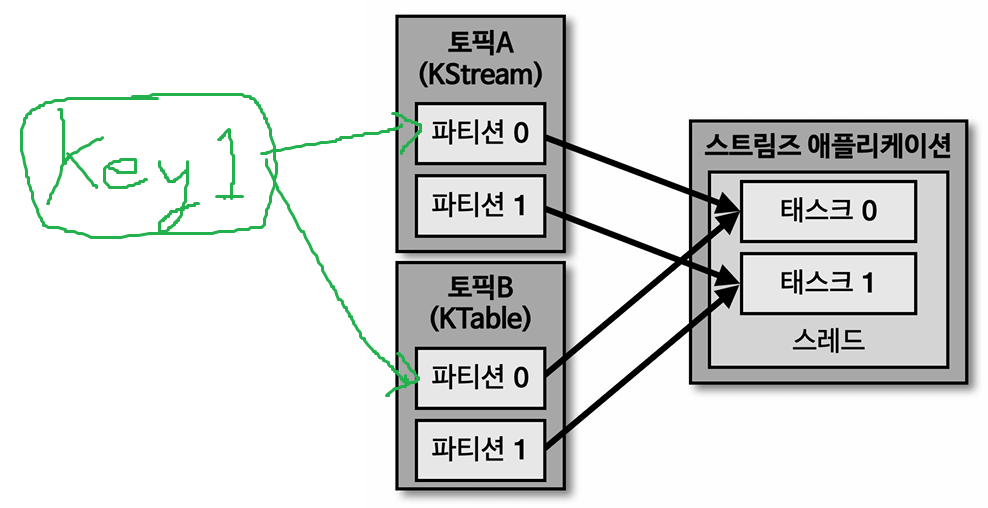
  * 코파티셔닝을 만족하지 않는다면?
    * 조인 대상 토픽들의 파티션에서 동일한 key에 대한 데이터를 찾을 수 없기 때문에 Join 태스크에서 정상적인 데이터 처리가 불가능하며,
    * `TopologyException`이 발생함
    * 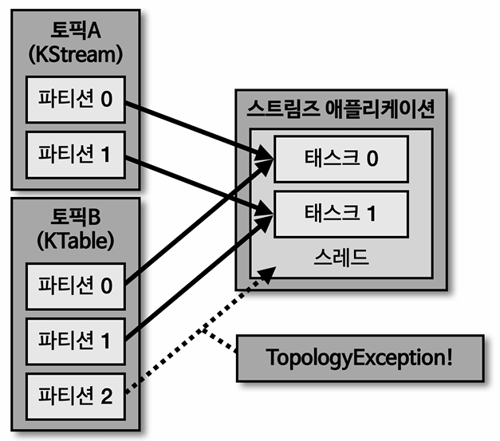
* `GlobalKTable`
  * 코파티셔닝 되지 않은 KStream과 KTable을 Join하여 데이터를 처리하고 싶다면, KTable을 GlobalKTable로 선언하여 사용하면 된다.
  * GlobalKTable로 정의된 데이터는 스트림즈 Application의 모든 태스크에 동일하게 공유된다.
    * 즉, 전체 데이터 복사본을 저장하는 전역 테이블인 것
  * GlobalKTable의 모든 데이터가 태스크에 공유되기 때문에, 조인 시 코파티셔닝이 불필요하다.
  * 하지만 어떤 토픽의 크기가 매우 커서 GlobalKTable이 비대해 지는 경우, 스트림즈 App의 태스크마다 GlobalKTable의 데이터를 가지고 있는 형태이기 때문에,
    * 매우 큰 용량이 필요하고 스트림즈 App 자체에 큰 부담이 될 수도 있다.
    * 따라서 토픽의 데이터가 크지 않은 경우이거나, Topic의 데이터 Retention 기간을 설정하여 GlobalKTable을 사용하는 것이 일반적
  * 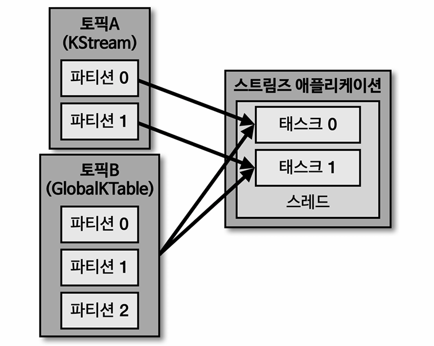

#### 7.4.3. 코파티셔닝을 만족하지 않은 두 Topic을 join 하는 방법
1. GlobalKTable 사용
2. 리파티셔닝 (**파티션 개수**만 다른 경우에 해당)
   * 파티션 개수를 맞춘 새로운 토픽 하나를 생성
   * 메시지 produce할때, 해당 토픽에 
  
#### 7.4.4. Streams DSL 라이브러리 추가
* 버전 확인
  * 설치된 kafka 버전 확인
  * kafka 4.0.0 사용중이므로 streams dsl 4.0.0 이상 버전을 사용해야 함
  * streams dsl 4.0.0은 java 17 이상의 버전을 사용해야 함
* gradle에 추가시 아래와 같음
  ```
  dependencies {
    implementation 'org.apache.kafka:kafka-streams:4.0.0'
  }
  ```

#### 7.4.5. Stream DSL 코드 예시
* KStream 코드 예시
  * `토픽1`로부터 레코드를 가져오고 필터링한 데이터를 `토픽2`에 저장
  ```java
  // props 정의는 생략...
  // Source Processor
  StreamsBuilder builder = new StreamsBuilder();
  KStream<String, String> streamLog = builder.stream("토픽1");
  
  // Stream Processor
  // KStream<String, String> filteredStream = streamLog.filter(
  //         (key, value) -> value.length() > 5);
  // filteredStream.to(STREAM_LOG_FILTER);
  streamLog.filter((key, value) -> value.length() > 5).to("토픽2");

  // Sink Processor
  KafkaStreams streams;
  streams = new KafkaStreams(builder.build(), props);
  streams.start(); // Kafka Streams 실행
  ```
* KStream과 KTable의 Join 코드 예시
  * 아래 코드가 정상 동작하기 위해서는 ADDRESS_TABLE 토픽과 ORDER_STREAM 토픽은 코파티셔닝을 만족해야 함
  ```java
  // Source Processor
  StreamsBuilder builder = new StreamsBuilder();
  KTable<String, String> addressTable = builder.table(ADDRESS_TABLE); // ADDRESS_TABLE을 KTable로 로드
  KStream<String, String> orderStream = builder.stream(ORDER_STREAM); // ORDER_STREAM을 KStream으로 로드

  // Stream Processor - KStream과 KTable을 조인하고 결과를 ORDER_JOIN_STREAM 토픽으로 전송
  orderStream.join(addressTable, (order, address) -> order + " send to " + address).to(ORDER_JOIN_STREAM);

  // Sink Processor
  KafkaStreams streams;
  streams = new KafkaStreams(builder.build(), props);
  streams.start();
  ```
* GlobalKTable이용한 join 예시
  * 
  ```java
  StreamsBuilder builder = new StreamsBuilder();

  // Source Processor
  GlobalKTable<String, String> addressGlobalTable = builder.globalTable(ADDRESS_GLOBAL_TABLE); // GlobalKTable로 Source Processor를 가져옴
  KStream<String, String> orderStream = builder.stream(ORDER_STREAM); // ORDER_STREAM을 KStream으로 로드

  orderStream.join(addressGlobalTable,
                  (orderKey, orderValue) -> orderKey, // join위한 키
                  (order, address) -> order + " send to " + address)
          .to(ORDER_JOIN_STREAM);

  KafkaStreams streams;
  streams = new KafkaStreams(builder.build(), props);
  streams.start();
  ```

<br><br>

## 8. Kafka Connect
* Kafka Connect는 데이터 파이프라인 생성시 반복 작업을 줄이고 효율적인 전송을 하기 위한 애플리케이션이다.
  * DB나 FS와 연결하는데 사용함
    * ex. DB의 데이터를 Topic에 저장하고자 할때, DB에서 select하고 Topic에 Produce하는 과정을 Template으로 만들어 반복적으로 사용할 수 있음
  * 특정 작업 형태를 템플릿으로 만들어 놓은 Connector를 실행함으로써 반복 작업을 줄일 수 있다.
* Kafka Connect 작동 방식
  * 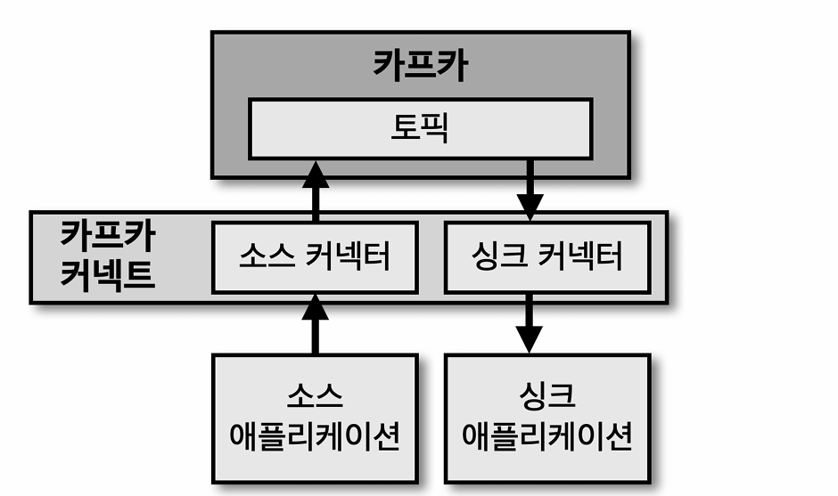
  * Source Connector: Producer 역할
  * Sink Connector: Consumer 역할
  * Connector는 오픈 소스를 이용할수도 있고 직접 개발하여 사용할 수도 있음
    * 오픈 소스 커넥터 ex. HDFS 커넥터, AWS S3 커넥터, JDBC 커넥터, ElasticSearch 커넥터 등
* Kafka Connect 내부 구조
  * 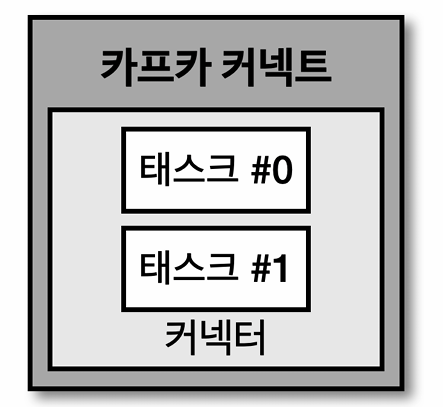
  * Kafka Connect 생성시 Connector와 Task를 생성해야 함
    * Connector에서는 주로 설정 값에 대한 Validation 로직들이 들어가고 모니터링에도 활용됨
    * Task는 Thread하나가 할당되며, 실질적인 데이터 처리 로직(DB와 연결, 리소스와 커넥트 등)이 들어감

<br>

### 8.1. Kafka Connect를 실행하는 방법
* 단일 모드 커넥트 (Standalone Mode Kafka Connect)
  * 개발 환경 구성 용도
* 분산 모드 커넥트 (Distributed Mode Kafka Connect)
  * 고가용성 구성 용도, failover 가능
  * 분산모드에서는 데이터량이 많아져 Consumer Lag이 늘어나거나 지연이 발생하는 경우 커넥트를 scale-out할 수 있음, scale-in도 마찬가지.

<br><br>

## 9. Kafka Streams vs Kafka Connect
* `Kafka Streams`는 윈도우 연산, 조인(Join), 집계(Aggregation) 등 **상태를 유지**해야 하는 복잡한 연산에 적합하며,
  * filter, map, branch 등 단순 변환 작업에 해당하는 Stateless 처리도 가능하다.
  * 즉, Kafka Streams는 Stateful 처리에 최적화되어 있지만, Stateless 작업도 수행 가능
* `Kafka Connect`는 **데이터 이동에 특화**되어 있음
  * Kafka와 외부 시스템(DB, 클라우드, 파일 등) 간 데이터 이동을 담당
  * 복잡한 연산이나 상태 관리(stateful data 관리)는 불가능함
  * 사전 정의된 커넥터(JDBC, Elasticsearch 등)를 사용해 코드 없이 데이터 연동 가능하다는 장점이 큼
  * 즉, Kafka Connect는 Stateless 데이터 이동에 특화되어 있으며, 복잡한 처리보다는 **데이터 연동이 목적**
* 따라서, 두 도구는 목적이 다르며 용도에 따라 사용하는 것이 일반적
  * ex. Kafka Connect로 데이터 수집 -> Kafka Streams로 실시간 처리 -> Kafka Connect로 결과 저장

<br>

### 9.1. Kafka Streams와 Kafka Connect를 포함한 카프카 아키텍처 예시
* 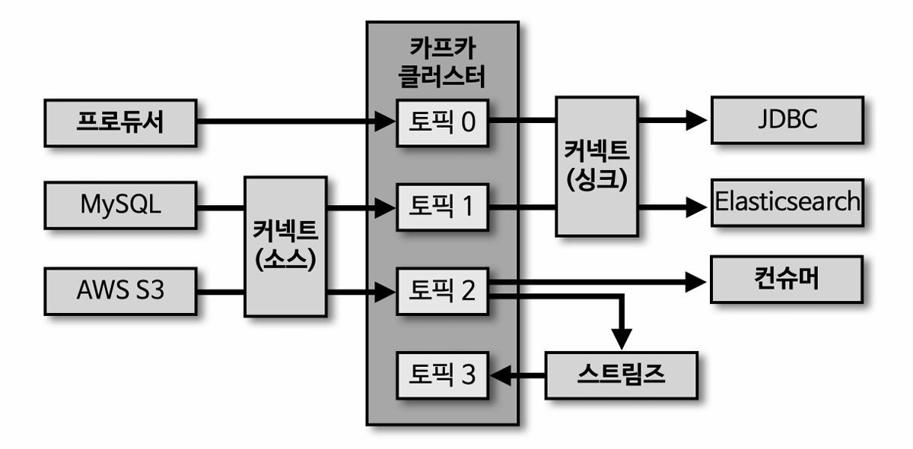

<br><br>

## 10. kafka 설정

### 10.1. kafka cluster 설정 (k8s 환경)
* KRaft 모드 설정 - `process.roles=broker,controller`
* Kafka KRaft(Kafka Raft) 모드에서 **컨트롤러 쿼럼(Quorum)**을 구성하는 노드(Pod에 해당)들의 목록을 지정
  * `"node.id=${HOSTNAME##*-}`: HOSTNAME이 k8s-worekr-01 ~ 03일 경우, node.id가 0~2로 할당됨
  * `controller.quorum.voters=0@kafka-controller-0.kafka-controller-headless.kafka.svc.cluster.local:9093, 1@..., 2@..., ...`
    * FQDN을 직접 명시해서 지정함
    * `{노드id}@{FQDN}` 형식
* `num.partitions=6`: 자동 생성되는 토픽의 파티션 개수 설정
* `num.network.threads=4`: 네트워크 스레드 개수 설정
  * 브로커가 네트워크에서 요청을 받고 응답을 전송하는 데 사용하는 스레드 수
* `num.io.threads=6`: I/O 스레드 개수 설정
  * 네트워크 스레드가 받은 요청을 실제로 처리(디스크 I/O 포함)하는 데 사용하는 스레드 수
  * **네트워크 스레드가 요청을 큐에 쌓으면, I/O 스레드가 이를 소비(처리)하는 구조**
* `min.insync.replicas=2`: acks=all 일때, 확인하는 ISR 파티션 개수 설정
* 설정 예시
  ```yaml
  configurationOverrides:
    - "process.roles=broker,controller" # 단일 노드가 브로커(데이터 처리)와 컨트롤러(메타데이터 관리) 역할을 동시에 수행
    - "node.id=${HOSTNAME##*-}" # 각 노드별 고유 ID 설정 - 노드 이름이 k8s-worker-01~03일 경우 StatefulSet 인덱스(0,1,2) 자동 할당
    - "controller.quorum.voters=0@kafka-controller-0.kafka-controller-headless.kafka.svc.cluster.local:9093,1@kafka-controller-1.kafka-controller-headless.kafka.svc.cluster.local:9093,2@kafka-controller-2.kafka-controller-headless.kafka.svc.cluster.local:9093" # FQDN 직접 명시
    - "advertised.listeners=CLIENT://kafka-controller-${HOSTNAME##*-}.kafka-controller-headless.kafka.svc.cluster.local:9092"
    - "listeners=CLIENT://:9092,CONTROLLER://:9093"
    - "listener.security.protocol.map=CLIENT:PLAINTEXT"
    - "num.partitions=3"
    - "num.network.threads=3"  # 기본값 5 -> 3으로 감소 설정
    - "num.io.threads=5"       # 기본값 8 -> 5로 감소 설정
    - "min.insync.replicas=2"  # 기본값 1 -> acks: "all" 사용시, ISR 파티션 개수 설정, 데이터 처리 속도에 큰 영향을 미치므로 신뢰성과의 trade-off 고려
  ```

<br>

### 10.2. Java App 설정
* spring boot 기반 App의 application.yaml 설정
* 설정 예시
```yaml
spring:
  kafka:
    bootstrap-servers: "kafka-controller-headless.kafka.svc.cluster.local:9092"
    properties:
      security.protocol: PLAINTEXT # 프로토콜 명시
      bootstrap.servers.protocol.map: CLIENT:PLAINTEXT
      client.id: "team-kafka-client" # 클라이언트 ID 지정
    producer:
      key-serializer: org.apache.kafka.common.serialization.StringSerializer
      value-serializer: org.apache.kafka.common.serialization.StringSerializer
      # enable.idempotence: true # true 시 중복 전송 방지, acks=all과 함께 사용, 3.0부터 true가 default
      # acks: "all" # all 이 default
    consumer:
      group-id: "team-service-group"
      auto-offset-reset: earliest
      key-deserializer: org.apache.kafka.common.serialization.StringDeserializer
      value-deserializer: org.apache.kafka.common.serialization.StringDeserializer
    streams:
      application-id: "team-streams-app"
```

<br><br>

## 11. Apache Kafka에 대한 고민
* kafka를 공부하면서 궁금하거나 헷갈렸던 내용들 정리

<br>

### 11.1. Kafka Streams에서, stateful processing으로 topic에 저장되는 데이터는 batch 데이터라고 볼 수 있을까?
> Stream 데이터와 Batch 데이터의 차이?

* Streams는 어떤 Topic에 데이터가 commit되면 해당 메시지를 소비하여 재가공하고 새로운 topic에 저장한다.
* ex. 주문량에 대해 1시간 구간으로 windowed stateful 프로세싱을 사용한다면?
  * 해당 데이터는 1시간 단위의 실시간(Stream) 데이터에 해당
  * 1시간 사이에 증분 업데이트(새로 추가되거나 수정된 데이터만 처리)된 결과가, Kafka 토픽에 스트림 형태로 저장되는 것
  * [09:00 ~ 10:00 매출 100만원], [10:00 ~ 11:00 매출 150만원], [11:00 ~ 12:00 매출 80만원], ...
* 따라서 해당 데이터는 1시간 단위의 스트림 데이터로 볼 수 있음
* 해당 데이터를 집계하여 월별 매출 데이터를 뽑아낸다고 하면? Batch데이터라고 할 수 있음
* 즉, 실시간으로 데이터 발생 즉시 처리되며 `지속적`으로 들어오는 데이터 형태가 Stream 데이터이며
* 월간 통계와 같이 일정 기간동안 수집된 데이터를 한번에 처리하여 `완결된` 데이터 형태가 Batch 데이터

<br>

### 11.2. Kafka를 이용한 동시성 이슈 해결
> Kafka를 이용하면 데이터 조회시 동시성 이슈를 완전히 해결할 수 있는걸까?

* Apache Kafka의 핵심 설계 원칙에 기반하여 동시성 문제가 거의 발생하지 않는다고 볼 수 있다.
* 아래와 같은 Kafka Topic의 특성 때문
  * 동일 Partition내 레코드는 항상 **단일 스레드에서 순차 처리**
  * 동일 키는 항상 동일 파티션으로 할당 (같은 파티셔닝 전략의 경우)
  * 트랜잭션 지원
    * isolation.level=read_committed 의 기본 설정으로 커밋된 트랜잭션만 노출
    * 중간에 실패한 트랜잭션 레코드는 롤백 처리
  * 추가로 Streams DSL의 KTable의 경우, 파티션별 상태 저장소(RocksDB)가 독립적으로 관리됨
* 하지만, 아래와 같은 상황에서 동시성 이슈가 발생할 수 있다.
  * 코파티셔닝을 만족하지 않은 Topic을 join하는 경우
  * 외부 시스템 연동하는 경우
    * ex. 외부 DB까지 Kafka의 트랜잭션이 보장되지 않음
  * 리더 파티션이 위치한 브로커의 장애 상황에서, ISR 외 팔로워가 리더로 승격되는 경우
    * 동시성 이슈를 넘어, 데이터 유실 가능성이 존재
    * `unclean.leader.election.enable=false`의 default 설정으로 비ISR 팔로워가 리더로 선출되지않도록 하는 설정이 있지만
    * `acks=all`, `min.insync.replicas=2` 설정을 통해 ISR을 최소 2개를 만족하도록 해주어야 함.
      * `min.insync.replicas=2` 설정시 1개의 브로커 장애를 허용할 수 있음

<br>

### 11.3. DB 없이 Kafka만 사용하는 것은 어떨까?
> Kafka가 데이터 저장소의 역할을 충분히 수행할 수 있을까?

* Kafka는 고성능, 고가용성, 확장성을 갖춘 **메시지 브로커**로, 메시지를 **일시적으로 저장**하고 여러 **소비자에게 전달**하는 역할을 한다.
  * 즉, 메시지를 잘 전달하기 위한 목적으로 사용되는 것임
* Kafka를 데이터 저장소를 목적으로 사용할 경우, 단점 및 한계
  * 장기 저장에 적합하지 않음
    * Kafka는 기본적으로 메시지를 일시적으로 저장(Retention 기반)하는 형태로 사용된다.
    * 애초에 kafka는 영구 저장소로는 설계되지 않았다.
  * 검색에 적합하지 않음
    * 빠른 검색(ex. index)이나 복잡한 쿼리로 검색이 가능한 DB와 비교하여,
    * Kafka는 Key기반 단순 검색만 가능
  * Random Access에 비효율적임
    * Kafka는 append-only 로그 구조로 설계되어 특정 위치의 데이터를 직접 탐색할 때 성능 저하 발생
      * ex. 특정 토픽의 3일 전의 메시지 검색은 토픽 전체 데이터 스캔이 필요함
    * DB는 인덱싱으로 O(1) 또는 O(log n) 시간 복잡도로 데이터에 접근이 가능
  * 운영 복잡성
    * Kafka만을 데이터 소스로 사용할 경우, 장애 복구, 데이터 정합성 등과 관련하여 운영 비용이 증가할 수 있다.
    * Kafka를 데이터베이스처럼 운영하려면 높은 전문성이 필요하기 때문에 비용이 클듯..
* 따라서 `최종 데이터 저장`에는 별도의 데이터베이스를 사용하는 것이 좋은듯

<br>

### 11.4. 중복 데이터 처리를 방지하는 방법
> 어떻게 신뢰성 있는 카프카 애플리케이션을 만들 수 있을까?
>
> Producer와 Consumer의 Exactly-Once 데이터 처리가 가능할까?

* 참고 글 - [Kafka Streams 실시간 스트리밍 데이터 처리: Exactly-Once](https://velog.io/@youngerjesus/Kafka-%EC%8B%A4%EC%8B%9C%EA%B0%84-%EC%8A%A4%ED%8A%B8%EB%A6%AC%EB%B0%8D-%EB%8D%B0%EC%9D%B4%ED%84%B0-%EC%B2%98%EB%A6%AC-Exactly-Once)
* 참고 영상 - [신뢰성 있는 카프카 애플리케이션을 만드는 3가지 방법](https://www.youtube.com/watch?v=7_VdIFH6M6Q)
* 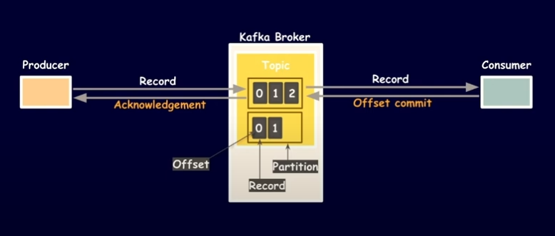
* kafka에서 프로듀서는 레코드를 생성하여 브로커(topic의 파티션...)에 전달하고,
* 컨슈머는 Topic으로부터 레코드를 가져와(offset기반...) 순차적으로 데이터 처리를 하는데
* 어떻게 데이터가 잘 전달되고 소비되었는지 확인할 수 있을까?
  * producer는 레코드를 전송한 이후에, acknowledgement 메시지를 받아 데이터가 잘 적재되었는지 확인 (위 이미지 참고)
  * consumer는 가져온 레코드를 처리한 이후에, commit 메시지를 전달하여 해당 레코드를 소비했음을 전달
* **네트워크 또는 Kafka App에 장애가 생겼을 경우, 데이터의 중복 적재/처리가 일어날 수 있다.**
  * `producer`가 네트워크 문제로 acknowledgement 메시지를 전달받지 못한다면
    * 동일 레코드가 다시 전송되어 중복 적재로 이어짐
  * `consumer`의 offset commit이 이루어지지 않은 상태에서 컨슈머 재시작 또는 리밸런싱 발생 시
    * 재시작된 Consumer 또는 파티션을 새로 할당받은 Consumer가 해당 레코드를 다시 읽어 데이터 중복 처리 발생

#### 811.4.1. Producer의 데이터 중복 적재를 방지
* 데이터의 중복 적재는 어떻게 일어날 수 있을까?
  * producer가 레코드 전달 이후, 네트워크 문제로 acknowledgement 메시지를 전달받지 못했을때,
  * producer는 레코드가 정상적으로 적재되지 않았다고 판단하여 다시 적재 요청을 할 수 있고, 이는 데이터의 중복 적재로 이어질 수 있다.
* 해당 문제는 멱등성 프로듀서(`Idempotence Producer`)를 이용하여 해결한다. (exactly-once)
  * 멱등성 producer가 브로커에게 데이터 적재 요청시 PID와 Seq 데이터를 함께 전송하여, 브로커에 중복 적재 요청이 왔을때 적재되지 않도록 할 수 있다.
  * 자세한 내용은 `4.3.` 항목 확인
* 하나의 Producer에서 여러 토픽에 데이터 적재가 필요한 경우, `Transaction Producer`를 이용하여 수도 있다.
  * 여러 파티션에 데이터를 전송해야 하는 경우, 특정 데이터의 전송이 실패할 수도 있는데
  * Transaction Producer를 사용하여 하나의 Transaction으로 묶어서(atomic단위로 묶어서) 처리 가능
    * 메시지 전송 모두 성공하거나 실패하도록 처리 가능
  * Transaction Producer 사용시 필요한 설정은 아래와 같다.
    * `enable.idempotence = true` (Transaction Producer는 멱등성 프로듀서 기반이기 때문)
    * `transactional.id = "unique-id"` (id는 클러스터내에 유일해야만 함)

#### 11.4.2. Consumer의 데이터 중복 처리를 방지
* Consumer의 데이터 중복 처리는 어떻게 일어날 수 있을까?
  * offset commit이 이루어지지 않은 상태에서 컨슈머 재시작 또는 리밸런싱(다른 컨슈머에게 파티션 할당)이 발생했을때,
  * 마지막으로 성공적으로 커밋된 offset 이후부터 데이터를 다시 읽어 오기 때문에 데이터 처리 과정에서 중복 처리가 이루어질 수 있다.
* 예시 시나리오 - `Topic A`->`Consumer X`->`Topic B` 과정중 리밸런싱 발생
   1. `컨슈머 X`가 `Topic A`의 파티션에서 `주문 레코드 R`을 읽고 처리한 `배송 데이터 D`를 `Topic B`로 전송하여 적재
   2. 적재 이후 `Topic A`의 파티션에 `주문 레코드 R`에 대한 Commit을 하기전, 리밸런싱 발생 (commit이 이루어지지 않은 상태)
   3. 리밸런싱 이후 새로 할당된 `컨슈머 Y`가 이전 오프셋(레코드R 이전)에서 재개
   4. `컨슈머 Y`가 `주문 레코드 R`을 재처리하여 `배송 데이터 F`를 `Topic B`에 적재
   5. `Topic B`에 `주문 레코드 R`에 대한 중복 `배송 레코드 D와 F`가 생성됨
* 그렇다면 리밸런싱이나 컨슈머 재시작이 일어나지 않도록 구성할 수는 없을까?
* **리밸런싱은 일어날 수 밖에 없음**
  * 네트워크나 Kafka App에 장애가 발생하는 경우
    * 세션 타임아웃(session.timeout.ms)이나 poll 간격 초과(max.poll.interval.ms) 등으로 컨슈머가 그룹에서 이탈할 때 등
  * 그룹 내에 컨슈머(pod단위)가 추가/재배포/제거될 경우
  * 토픽의 파티션 수가 변경될 때 등..
  * 참고로, 리밸런싱은 배포 외에는 일어나는 일이 거의 없다고 함. [출처](https://www.inflearn.com/community/questions/1314430/consumer-%EC%9E%AC%EB%B0%B0%ED%8F%AC%EC%8B%9C-%EB%A6%AC%EB%B0%B8%EB%9F%B0%EC%8B%B1-%EC%9D%B4%EC%8A%88)
* 따라서, At-least-once을 가정하고 Kafka App을 개발해야 한다.
* 데이터의 중복 처리가 발생하지만 적재는 한번만 될 수 있도록 개발한다면 즉, **중복으로 요청되는 데이터 적재를 멱등하게 처리를 할 수 있도록 개발**한다면
* Exactly-Once Semantics을 달성할 수 있다.
* 어떻게 멱등성을 만족하여 데이터를 처리할 수 있을까?
  * Topic to Topic 으로 데이터를 처리하고 적재하는 경우
    * 두 Topic은 Kafka에서 관리되는 자원이기 때문에,
    * Kafka의 Transaction(트랜잭션 컨슈머와 프로듀서)을 이용하여 consumer와 producer의 로직을 한번에(atomic) 처리할 수 있다.
    * 즉, offset commit이 이루어지지 않은 상태에서 리밸런싱이 일어나는 상황이 생겨도 원자적으로 데이터 처리가 가능하기 때문에 중복 처리 발생하지 않음
      * 정상작동 예시1
        * 컨슈머가 `Topic A`로부터 `주문 레코드 R`을 가져오고 `배송 데이터 D`로 처리, `Topic B`에 적재
        * 그리고 커밋(`producer.commitTransaction()`)
      * 리밸런싱 예시2
        * 컨슈머가 `Topic A`로부터 `주문 레코드 R`을 가져오고 `배송 데이터 D`로 처리, `Topic B`에 적재도중 리밸런싱 발생
        * transaction 롤백으로 `Topic B`에 `배송 데이터 D`는 삭제, offset도 커밋되지 않음
        * 리밸런싱 이후 새로 할당된 컨슈머가 마지막 커밋된 오프셋부터 재처리하여 `주문 레코드 R`을 정상 처리하고 `Topic B`에 배송 데이터 적재
        * 이후 offset 커밋(`producer.commitTransaction()`)으로 정상적으로 레코드가 처리됨
    * 필요 옵션 - producer와 consumer 설정 모두 필요
      * `producer.enable.idempotence = true` - Transaction Producer는 멱등성 프로듀서 기반이므로 설정
      * `producer.transactional.id = "{unique-id}"` - 트랜잭션 식별 id, 고유한 값으로 설정(다른 프로듀서와 겹치면 안됨)
      * `consumer.enable-auto-commit: false` - 컨슈머가 offset을 커밋하지 않고 프로듀서가 커밋을 수행해야 하므로 auto-commit은 false설정
      * `consumer.isolation-level: read_committed`
        * read_uncommitted가 default 옵션이므로 변경 필요
        * 트랜잭션 완료(commit)된 메시지만 소비하도록 보장
        * 특히 리밸런싱 후 새 컨슈머가 아직 완료되지 않은 트랜잭션의 메시지를 읽지 않도록 함으로써 중복 처리를 방지
    * Transaction 이용한 코드 예시
      ```java
      producerProps.put(TRANSACTIONAL_ID_CONFIG, "AD_TRANSACTION"); // 트랜잭션 프로듀서 옵션 (transaction.id)
      producer.initTransactions(); // 트랜잭션 프로듀서 초기화
      try {
          while (true) {
              ConsumerRecords<String, String> records = consumer.poll(ofSeconds(10));
              // ... records를 사용한 데이터 처리 생략
              producer.beginTransaction();
              producer.send(new ProducerRecord<String, String>("다음 토픽", "처리가 완료된 이벤트"));
              // 컨슈머가 오프셋을 커밋하지 않고 프로듀서가 커밋을 수행한다.
              // 그러므로 반드시 컨슈머의 enable.auto.commit을 false로 설정한다.
              producer.sendOffsetsToTransaction(getRecordOffset(), CONSUMER_GROUP_ID);
              producer.commitTransaction();
          }
      } catch (KafkaException e) {
          producer.abortTransaction();
      }
      ```
  * Topic to 외부 저장소(ex. DB)로 데이터 처리하는 경우
    * Topic은 Kafka에서 관리되는 자원이지만 외부 저장소는 아니기 때문에,
    * Kafka의 Transaction으로 한번에 처리할 수 없다. 따라서 외부 저장소의 특성을 이용하여, 아래의 2가지 방식을 고려해 볼 수 있다.
      * `Unique Key`: Unique key 지원하는 DB의 경우, 같은 key로 데이터 적재 요청시 중복 적재되지 않도록 함
      * `Upsert(update + insert)`: 데이터를 삽입할 때, 이미 해당 데이터가 존재한다면 업데이트를 수행하고, 존재하지 않는다면 삽입 되도록 함
        * ex. MongoDB, Postgresql, github

#### 11.4.3. Kafka Streams를 이용한 Consumer의 데이터 중복 처리 방지
* Kafka Streams의 `processing.guarantee=exactly_once_v2` 옵션을 활성화하면, 프레임워크가 내부적으로 트랜잭션을 관리하므로
* `8.4.2.` 항목에서 Transaction 이용한 코드 예시 처럼 **개발자가 직접 오프셋 커밋을 제어할 필요가 없다.**
  * 오프셋 커밋과 같은 트랜잭션관련 로직을 직접 작성하지 않아도 된다!
* 따라서 `enable-auto-commit` 설정을 true로 설정하여, 트랜잭션 완료 후 자동 커밋되도록 할 수 있다.
* 또한 데이터 처리 도중 리밸런싱이 일어날 경우에는 미커밋 Transaction은 롤백되므로 데이터의 중복 처리 방지가 가능하다.
* 옵션 설정 (kafka Streams App 설정)
  * `producer.enable.idempotence = true` - exactly_once_v2 설정 시 자동 활성화
  * `producer.transactional.id = "{unique-id}"` - Kafka Streams가 내부적으로 자동 생성 (애플리케이션 ID + 스레드 정보)
  * `consumer.isolation-level: read_committed` - default: read_uncommitted
  * `consumer.enable-auto-commit: true` - default: true (Streams가 재정의)
  * `streams.processing.guarantee: exactly_once_v2` - default: at_least_once
  * `streams.properties.commit.interval.ms: 100` - default: 100ms
* kafka cluster 옵션 설정
  * default설정 제외하고 kafka 4.0.0, KRaft 모드 기준으로,
  * `transaction.state.log.min.isr=2` 옵션 필요 (default: 1)
  * 트랜잭션 로그가 커밋되기 위해 필요한 트랜잭션 로그의 최소 동기화 복제본(ISR) 수에 해당
* Transaction Producer와 Consumer를 직접 사용하는 것과의 차이는?
  * Transaction을 직접 사용할 경우에는 오프셋 커밋을 코드를 통해 직접적으로 제어해야 하지만
    * exactly_once_v2 옵션 사용시 Stream 코드 작성하면 알아서 Transaction 으로 동작
  * Streams의 exactly_once_v2 옵션을 사용하는 경우 auto-commit을 사용하게 되는데,
    * 일정 간격을 주기로 Topic의 변경사항과 오프셋을 커밋한다.
    * 주기는 streams.properties.commit.interval.ms 옵션으로 설정


#### 11.4.4. 데이터 중복 처리 방지 내용 정리
* Producer의 데이터 중복 적재 문제는 Idempotence Producer나 Transaction Producer(여러 Produce 로직 묶는 경우) 사용
* Consumer의 데이터 중복 처리 문제는,
  * Topic to Topic 으로 Kafka에서 관리 가능한 경우
    * Transaction Consumer & Producer 사용
    * 또는 Kafka Streams 사용시 exactly_once_v2 옵션 사용
  * Topic의 레코드 처리후 외부 저장소로 적재하는 경우 - Unique Key 이용하거나 Upsert방식 이용
* 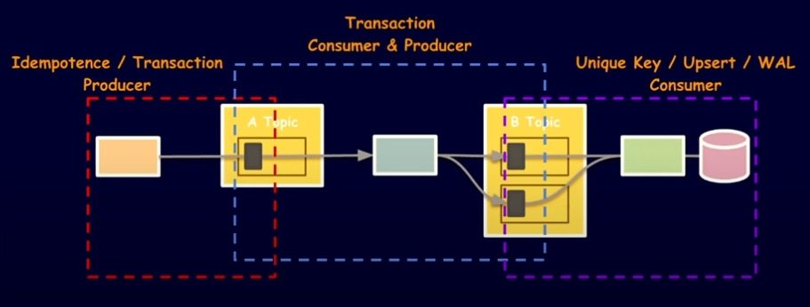

<br>

### 11.5. 모든 데이터가 일관성을 가지도록, 순차적으로 메시지를 처리할 수 있을까? 어떤 기준으로 Topic을 나눠야 할까? 
> 데이터 일관성을 위해 Topic내 메시지들을 모두 순차적으로 처리 가능할까?

* kafka에 발행된 이벤트 메시지가 순차적으로 처리되지 않으면, 데이터의 상태가 실제와 불일치하는 문제가 발생할 수 있다.
  * ex. 유저의 상태를 offline으로 변경후 online으로 변경했는데, online으로 변경하는 이벤트가 먼저 처리 된다면?
* 어떻게 데이터의 일관성을 유지할 수 있을까?
  * 기본적으로 kafka에서 메시지를 발행하면 메시지의 key에 따라 Topic의 partition에 분산되어 저장된다.
  * partition에서 offset으로 어디까지 읽은 메시지인지 확인할 수 있기 때문에, Consumer가 메시지를 순차적으로 처리할 수 있다.
  * 따라서 데이터를 partition 단위로 관리할 수 있다면, 데이터의 일관성을 유지할 수 있다.
* Topic은 고가용성, 확장성, 병렬처리 등의 이유로 여러개의 partition을 가지고 있다.
* Topic은 무엇을 기준으로 분류하는 것이 좋을까?
  * Topic은 일반적으로 AggregateType(도메인)을 기준으로 분류한다.
  * 그리고 eventType은 메시지의 payload나 header에서 구분하는 방식이 가장 일반적인 방법이다.
  * 왜 도메인 기준으로 Topic을 정함?
    * 도메인 단위로 topic을 묶으면 확장성과 관리가 용이하기 때문
      * eventType 기준으로 topic을 나누게 되면, 이벤트 추가나 변경시 토픽 개수가 계속해서 추가될 수 있기 때문에 관리가 어렵다.
      * 도메인에 관심 있는 서비스만 구독하도록 하면 되기 때문에 consumer 구성이 편함
      * 확장성 - 파티션 단위 병렬 처리에 유리 (아래에서 설명)
* Topic 기준이 넓은 범위(도메인 기준)로 여러 이벤트들을 포함하고 있고, 가지고 있는 partition 또한 여러개인데, 각각의 이벤트를 모두 순차적으로 처리하는 것이 가능할까?
  * 특별한 partition 전략을 사용하지 않는다면, 발행된 이벤트 메시지는 메시지 key를 기준으로 항상 동일한 파티션에 저장된다.
  * 즉, Topic내에서 같은 키에 대한 메시지는 항상 같은 Consumer가 처리하도록 할 수 있기 때문에 offset을 이용하여 메시지가 순차적으로 처리되는 것을 보장할 수 있다.
  * 따라서 같은 키를 가진 상태 변경 이벤트는 순서 보장이 가능하며, 최종적으로 데이터 일관성 유지가 가능하다.

<br>
